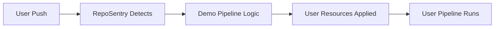

# RepoSentry Tekton Demo Pipeline

This directory contains a complete demonstration pipeline that showcases how RepoSentry can detect and execute Tekton resources from user repositories.

## 🎯 What This Demo Does

The demo pipeline performs the following actions:

1. **Clone Repository**: Clones the target GitHub repository [tekton-workflow-gh-demo](https://github.com/johnnynv-org/tekton-workflow-gh-demo)
2. **Scan Tekton Resources**: Lists and displays all Tekton YAML files in `.tekton/pipelines/`
3. **Validate Resources**: Validates YAML syntax and identifies Tekton resources
4. **Apply Resources**: Applies discovered Tekton resources to the cluster
5. **Demonstrate Results**: Shows the applied resources and their status

## 📁 Files Structure

```
demo/
├── demo-pipeline.yaml     # Main Pipeline definition
├── demo-pipelinerun.yaml  # PipelineRun configuration
├── deploy-demo.sh         # Automated deployment script
└── README.md             # This documentation
```

## 🚀 Quick Start

### Prerequisites

1. **Tekton Pipelines installed**:
   ```bash
   kubectl apply --filename https://storage.googleapis.com/tekton-releases/pipeline/latest/release.yaml
   ```

2. **kubectl access** to your Kubernetes cluster

3. **git-clone ClusterTask** (the script will install it if missing)

### Automated Deployment

Run the deployment script:

```bash
./deploy-demo.sh
```

The script will:
- ✅ Check prerequisites
- ✅ Install missing components
- ✅ Create the demo pipeline
- ✅ Optionally run the pipeline
- ✅ Provide monitoring commands

### Manual Deployment

If you prefer manual steps:

```bash
# 1. Create demo namespace
kubectl create namespace reposentry-demo

# 2. Install git-clone task (if not present)
kubectl apply -f https://raw.githubusercontent.com/tektoncd/catalog/main/task/git-clone/0.9/git-clone.yaml

# 3. Apply the pipeline
kubectl apply -f demo-pipeline.yaml

# 4. Run the pipeline
kubectl create -f demo-pipelinerun.yaml
```

## 📊 Monitoring Pipeline Execution

### View Pipeline Status

```bash
# List all PipelineRuns
kubectl get pipelineruns -n default

# Get detailed status
kubectl describe pipelinerun <pipelinerun-name> -n default
```

### Follow Logs

```bash
# Follow logs for specific PipelineRun
kubectl logs -f pipelinerun/<pipelinerun-name> -n default

# Follow logs for specific task
kubectl logs -f pipelinerun/<pipelinerun-name> -c step-<step-name> -n default
```

### Tekton Dashboard (Optional)

If you have Tekton Dashboard installed:

```bash
kubectl port-forward -n tekton-pipelines svc/tekton-dashboard 9097:9097
```

Then visit: http://localhost:9097

## 🎭 Expected Demo Output

When the pipeline runs successfully, you should see:

### Task 1: git-clone
- Clones the demo repository
- Checks out the main branch

### Task 2: list-tekton-resources
- Scans `.tekton/pipelines/` directory
- Lists all YAML files found
- Shows content preview of each file

### Task 3: validate-tekton-resources
- Validates YAML syntax
- Identifies Tekton resource types (Pipeline, Task, etc.)
- Reports validation status

### Task 4: apply-tekton-resources
- Creates `reposentry-demo` namespace
- Applies Tasks first, then Pipelines
- Shows application results

### Task 5: demonstrate-resources
- Lists applied Tasks and Pipelines
- Shows recent PipelineRuns
- Provides detailed view of created resources

## 🔧 Pipeline Parameters

The pipeline accepts these parameters:

| Parameter | Description | Default |
|-----------|-------------|---------|
| `repository-url` | Git repository URL to clone | `https://github.com/johnnynv-org/tekton-workflow-gh-demo` |
| `branch-name` | Git branch to checkout | `main` |
| `tekton-path` | Path to Tekton resources | `.tekton/pipelines` |
| `target-namespace` | Namespace for applied resources | `reposentry-demo` |

### Custom Parameters Example

```bash
# Create PipelineRun with custom parameters
cat <<EOF | kubectl create -f -
apiVersion: tekton.dev/v1beta1
kind: PipelineRun
metadata:
  generateName: custom-demo-run-
spec:
  pipelineRef:
    name: reposentry-demo-pipeline
  params:
    - name: repository-url
      value: "https://github.com/your-org/your-repo"
    - name: tekton-path
      value: ".tekton/custom"
    - name: target-namespace
      value: "my-demo"
  workspaces:
    - name: source-code
      volumeClaimTemplate:
        spec:
          accessModes: [ReadWriteOnce]
          resources:
            requests:
              storage: 1Gi
    - name: tekton-resources
      volumeClaimTemplate:
        spec:
          accessModes: [ReadWriteOnce]
          resources:
            requests:
              storage: 500Mi
EOF
```

## 🛠️ Troubleshooting

### Common Issues

#### 1. Pipeline Not Found
```bash
# Check if pipeline exists
kubectl get pipeline reposentry-demo-pipeline -n default

# If missing, reapply
kubectl apply -f demo-pipeline.yaml
```

#### 2. Git Clone Fails
```bash
# Check if repository URL is accessible
curl -I https://github.com/johnnynv-org/tekton-workflow-gh-demo

# Verify git-clone ClusterTask
kubectl get clustertask git-clone
```

#### 3. Permission Issues
```bash
# Check if current context has sufficient permissions
kubectl auth can-i create pipelines
kubectl auth can-i create namespaces
```

#### 4. Resource Application Fails
```bash
# Check target namespace exists
kubectl get namespace reposentry-demo

# Verify YAML files in source
kubectl logs pipelinerun/<name> -c step-scan-resources
```

### Debug Commands

```bash
# Get all resources related to the demo
kubectl get all -l app.kubernetes.io/name=reposentry

# Check events for troubleshooting
kubectl get events --sort-by=.metadata.creationTimestamp

# Describe failed PipelineRun
kubectl describe pipelinerun <name> -n default
```

## 🎯 Integration with RepoSentry

This demo pipeline serves as a template for what RepoSentry's Bootstrap Pipeline will do:

1. **Detection Phase**: RepoSentry detects `.tekton/` directories in user repositories
2. **Trigger Phase**: RepoSentry creates a PipelineRun similar to this demo
3. **Execution Phase**: The Bootstrap Pipeline processes user's Tekton resources
4. **Isolation**: Each user repository gets its own namespace for security

### Relationship to RepoSentry Architecture



## 📚 Next Steps

1. **Explore the target repository**: Visit [tekton-workflow-gh-demo](https://github.com/johnnynv-org/tekton-workflow-gh-demo) to see the structure
2. **Modify parameters**: Try running with different repositories or paths
3. **Customize the pipeline**: Adapt the demo for your specific use cases
4. **Integrate with RepoSentry**: Use this as a foundation for Bootstrap Pipeline development

## 🤝 Contributing

This demo is part of the RepoSentry project. To contribute:

1. Test the demo with different repositories
2. Report issues or suggest improvements
3. Extend the pipeline for additional use cases
4. Update documentation with your findings


