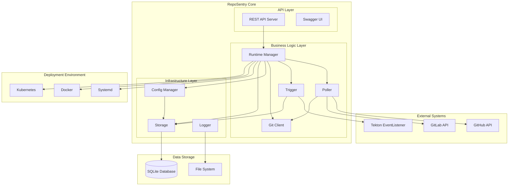
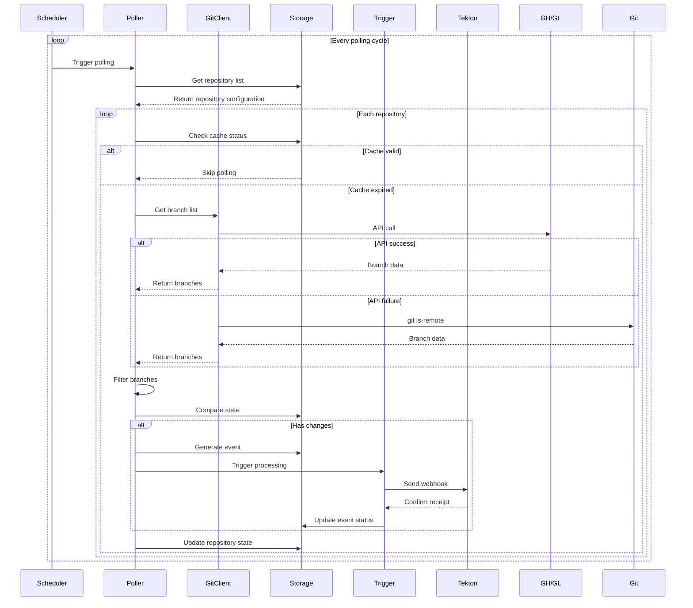
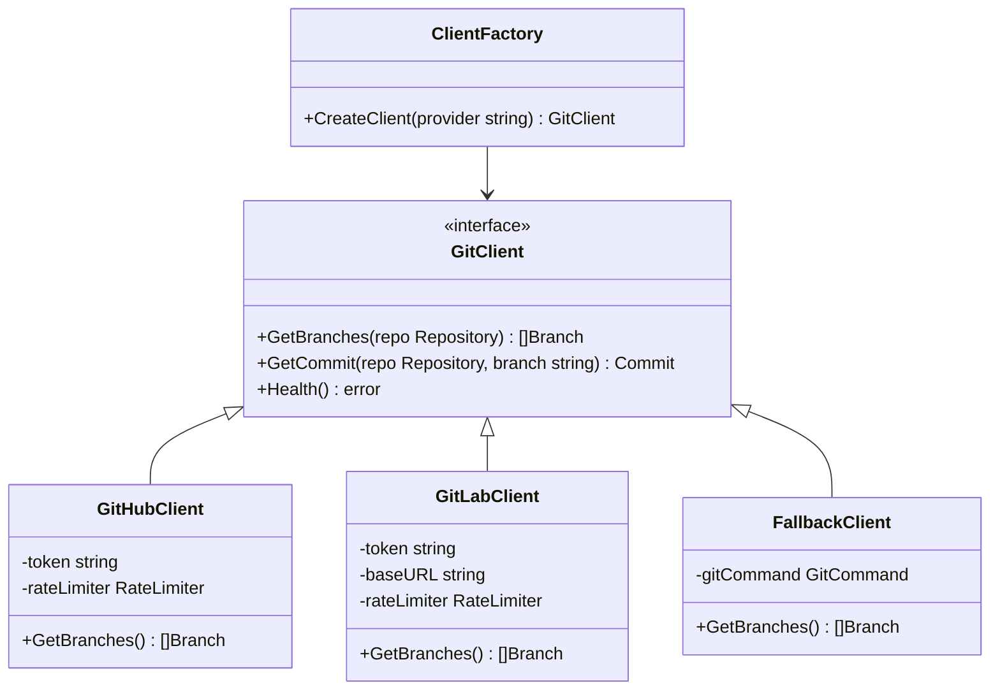
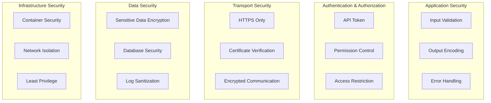
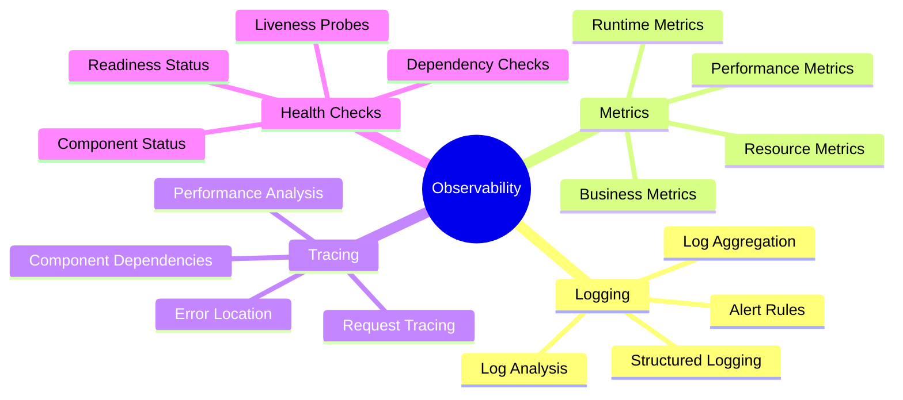
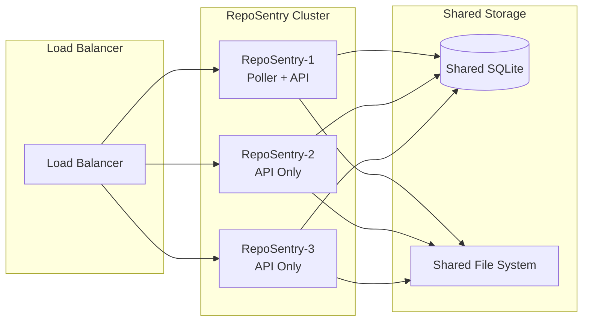
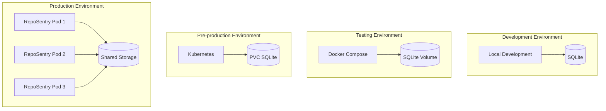

# RepoSentry Technical Architecture

## 🎯 Overview

RepoSentry is a lightweight, cloud-native Git repository monitoring sentinel designed specifically for the Tekton ecosystem. It adopts a modular architecture with intelligent polling strategies, high availability, and scalability.

## 🏗️ System Architecture

### Overall Architecture



### Core Components

#### 1. Runtime Manager
- **Responsibility**: Component lifecycle management, service orchestration
- **Functions**: Start/stop, health checks, dependency injection
- **Interfaces**: `Runtime`, `Component`

#### 2. Poller
- **Responsibility**: Repository change detection, event generation
- **Functions**: Intelligent polling, branch filtering, state caching
- **Strategy**: API-first with git command fallback

#### 3. Trigger
- **Responsibility**: Event processing, external system triggering
- **Functions**: Tekton integration, retry mechanism, idempotency guarantee

#### 4. Git Client
- **Responsibility**: Git provider API abstraction
- **Functions**: GitHub/GitLab API, rate limiting, error handling

#### 5. Storage
- **Responsibility**: Data persistence, state management
- **Functions**: SQLite abstraction, database migration, transaction management

#### 6. Config Manager
- **Responsibility**: Configuration loading, validation, hot reload
- **Functions**: YAML parsing, environment variable expansion, configuration validation

## 🔄 Processing Flow

### Core Workflow



## 🏗️ Component Design

### 1. Runtime Manager

#### Architecture Design

```go
type Runtime interface {
    Start(ctx context.Context) error
    Stop(ctx context.Context) error
    GetStatus() *RuntimeStatus
    Health() error
}

type Component interface {
    Start(ctx context.Context) error
    Stop(ctx context.Context) error
    Health() error
    Name() string
}
```

### 2. Poller Component

#### Multi-layer Architecture

```
┌─────────────────────────────────────┐
│           Scheduler                 │  ← Scheduler: Manage polling cycles
├─────────────────────────────────────┤
│        Branch Monitor               │  ← Branch monitoring: Handle single repository
├─────────────────────────────────────┤
│        Event Generator              │  ← Event generation: Change detection and event creation
├─────────────────────────────────────┤
│         Git Client                  │  ← Client: API calls and fallback
└─────────────────────────────────────┘
```

### 3. Git Client

#### Client Architecture



## 🔧 Technology Stack

### Core Technologies

| Component | Technology Choice | Reason |
|-----------|-------------------|--------|
| **Language** | Go 1.21+ | High performance, concurrency support, cloud-native ecosystem |
| **Web Framework** | Gorilla Mux | Lightweight, standard library compatible, flexible routing |
| **Database** | SQLite | Zero dependencies, embedded, transaction support |
| **Configuration** | YAML + Viper | Human readable, strongly typed, environment variable support |
| **Logging** | Logrus | Structured logging, multiple output formats, excellent performance |
| **HTTP Client** | net/http | Standard library, controllable, context support |
| **Container** | Docker | Standardized, portable, easy deployment |
| **Orchestration** | Kubernetes | Cloud-native, auto-scaling, high availability |

### Performance Metrics

| Metric | Target | Current |
|--------|--------|---------|
| **Startup Time** | < 5s | ~2s |
| **Memory Usage** | < 512MB | ~128MB |
| **API Response Time** | < 100ms | ~50ms |
| **Polling Latency** | < 30s | ~15s |
| **Concurrent Processing** | 100+ repositories | Tested pass |

## 🔐 Security Architecture

### Security Layers



## 📊 Monitoring Architecture

### Observability Layers



## 🚀 Scalability Design

### Horizontal Scaling



## 🔄 Deployment Architecture

### Multi-environment Deployment



## 🛠️ Development Architecture

### Code Organization

```
RepoSentry/
├── cmd/reposentry/           # CLI entry point
├── internal/                 # Internal packages
│   ├── api/                 # REST API server
│   ├── config/              # Configuration management
│   ├── gitclient/           # Git client
│   ├── poller/              # Polling logic
│   ├── runtime/             # Runtime management
│   ├── storage/             # Storage layer
│   └── trigger/             # Trigger system
├── pkg/                      # Public packages
│   ├── logger/              # Logging component
│   ├── types/               # Type definitions
│   └── utils/               # Utility functions
├── deployments/              # Deployment configurations
├── docs/                     # Documentation
├── examples/                 # Example configurations
└── test/                     # Test files
```

### Design Principles

#### 1. SOLID Principles
- **Single Responsibility**: Each component handles one functionality
- **Open/Closed**: Support extension, refuse modification
- **Liskov Substitution**: Interfaces can replace implementations
- **Interface Segregation**: Fine-grained interface design
- **Dependency Inversion**: Depend on abstractions, not concrete implementations

#### 2. 12-Factor App
- **Configuration**: Environment variables and configuration file separation
- **Dependencies**: Explicitly declare and isolate dependencies
- **Config**: Store configuration in environment
- **Backing Services**: Services as attached resources
- **Logs**: Logs as event streams

#### 3. Cloud-native Principles
- **Stateless**: Application layer stateless design
- **Observable**: Health checks, metrics, logs
- **Scalable**: Horizontal scaling support
- **Fault-tolerant**: Graceful degradation and error recovery

## 📈 Performance Optimization

### Polling Optimization

```go
// Adaptive polling interval
type AdaptivePoller struct {
    baseInterval    time.Duration
    maxInterval     time.Duration
    backoffFactor   float64
    activityWindow  time.Duration
}

func (p *AdaptivePoller) NextInterval(repo *Repository) time.Duration {
    // Adjust polling interval based on repository activity
    activity := p.getRecentActivity(repo)
    if activity > 0.8 {
        return p.baseInterval // High activity, frequent polling
    } else if activity < 0.2 {
        return p.maxInterval // Low activity, reduce frequency
    }
    return time.Duration(float64(p.baseInterval) * (1 + activity))
}
```

### Caching Strategy

```go
type CacheStrategy interface {
    Get(key string) (interface{}, bool)
    Set(key string, value interface{}, ttl time.Duration)
    InvalidatePattern(pattern string)
}

// Branch cache
type BranchCache struct {
    cache    map[string]CacheEntry
    ttl      time.Duration
    maxSize  int
}
```

## 🔮 Future Architecture Evolution

### Short-term Goals (3-6 months)

1. **Multi-database Support**: PostgreSQL, MySQL
2. **Message Queue**: Redis, RabbitMQ integration
3. **Configuration Hot Reload**: Real-time configuration changes
4. **Metrics Monitoring**: Prometheus integration

### Medium-term Goals (6-12 months)

1. **Distributed Architecture**: Multi-node deployment
2. **Plugin System**: Custom triggers
3. **Web UI**: Management interface
4. **Alert System**: Multi-channel notifications

### Long-term Goals (12+ months)

1. **AI Intelligence**: Intelligent polling strategies
2. **Multi-cloud Support**: AWS, Azure, GCP
3. **GraphQL API**: Flexible query interface
4. **Microservice Architecture**: Service decomposition

---

## 📚 Related Documentation

- [Quick Start Guide](QUICKSTART.md)
- [User Manual](USER_MANUAL.md)
- [Deployment Guide](../../deployments/README.md)
- [Development Guide](DEVELOPMENT.md)
- [API Documentation](../API_EXAMPLES.md)
