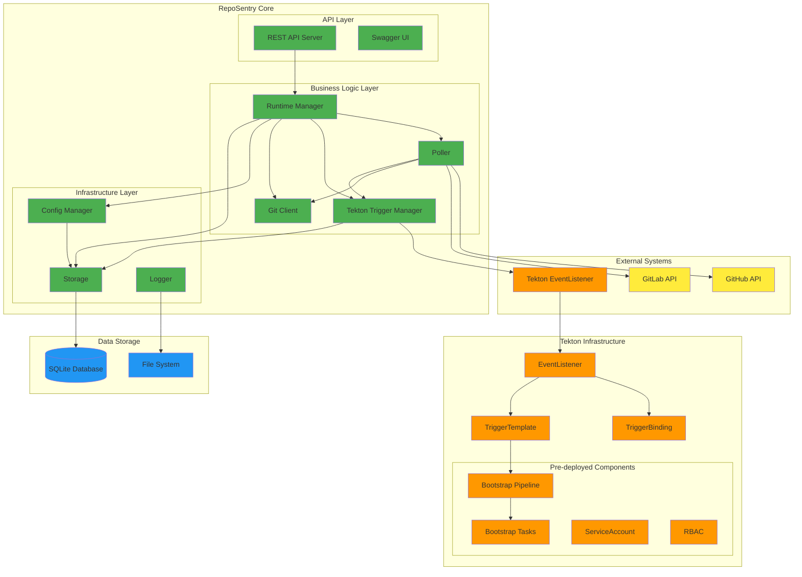
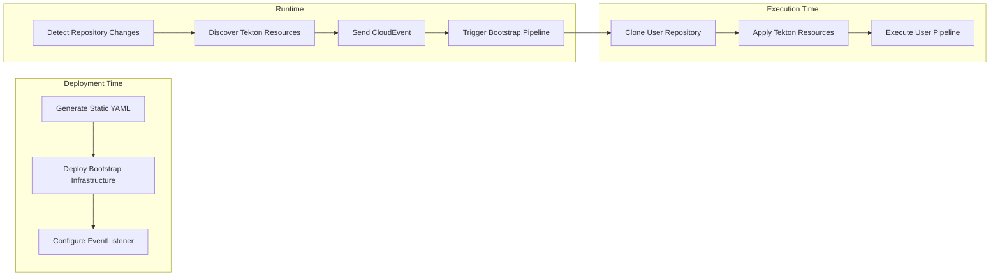
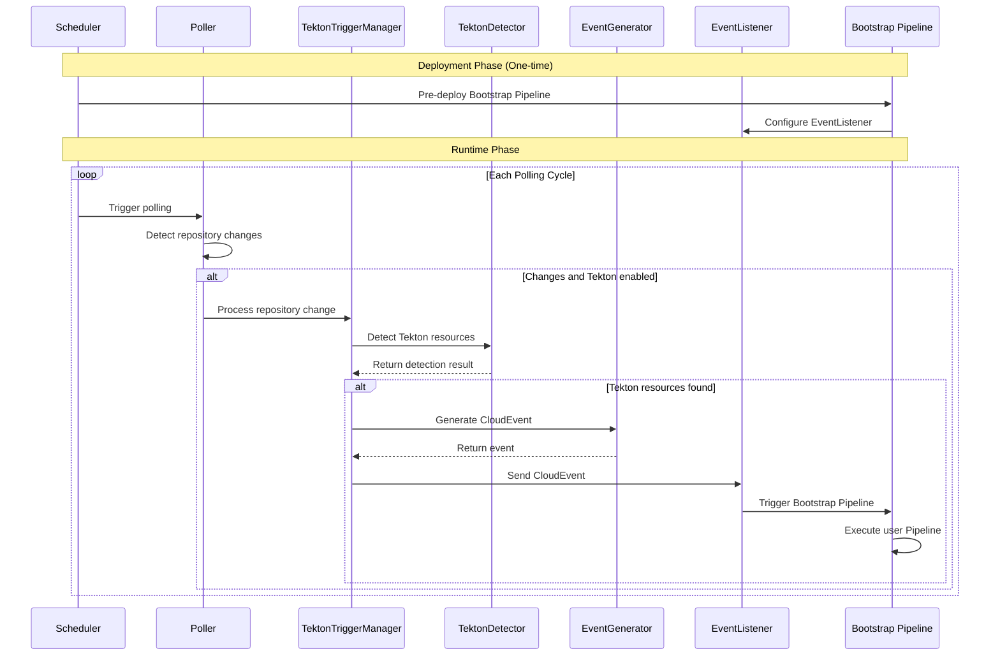
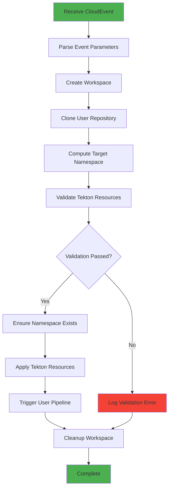
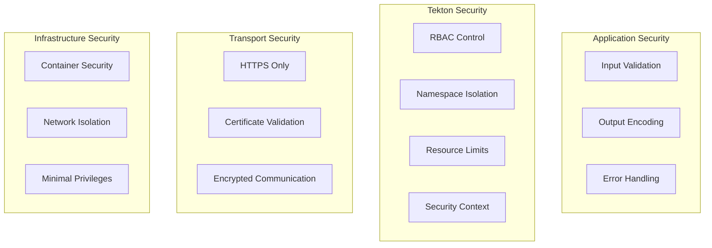
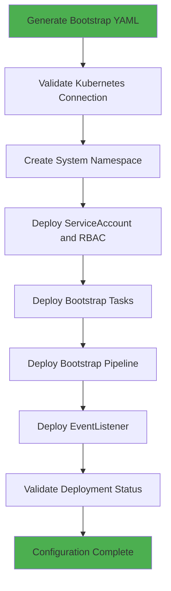

# RepoSentry Technical Architecture Documentation

## 🎯 Overview

RepoSentry is a lightweight, cloud-native Git repository monitoring sentinel designed specifically for the Tekton ecosystem. It adopts a modular architecture with pre-deployed Bootstrap Pipeline design, intelligent polling strategies, high availability, and scalability.

## 🏗️ System Architecture

### Overall Architecture Diagram



### Core Components

#### 1. Runtime Manager
- **Responsibility**: Component lifecycle management, service orchestration
- **Functions**: Start/stop, health checks, dependency injection
- **Interfaces**: `Runtime`, `Component`

#### 2. Poller
- **Responsibility**: Repository change detection, event generation
- **Functions**: Intelligent polling, branch filtering, state caching
- **Strategy**: API first, Git command fallback

#### 3. Tekton Trigger Manager
- **Responsibility**: Tekton resource detection, CloudEvent generation
- **Functions**: Detect `.tekton` directory, send events to pre-deployed Bootstrap Pipeline
- **Features**: Lightweight, focused on event triggering

#### 4. Git Client
- **Responsibility**: Git provider API encapsulation
- **Functions**: GitHub/GitLab API, rate limiting, error handling

#### 5. Storage Layer
- **Responsibility**: Data persistence, state management
- **Functions**: SQLite encapsulation, database migration, transaction management

#### 6. Config Manager
- **Responsibility**: Configuration loading, validation, hot reload
- **Functions**: YAML parsing, environment variable expansion, configuration validation

## 🔄 Tekton Integration Architecture

### Bootstrap Pipeline Design Philosophy



### Pre-deployed Component Architecture

```mermaid
classDiagram
    class BootstrapDeployment {
        +StaticYAMLFiles()
        +InstallScript()
        +VerifyDeployment()
        +UninstallScript()
    }
    
    class TektonTriggerManager {
        +ProcessRepositoryChange()
        +SendBootstrapEvent()
        +GetDetectionStatus()
        +IsEnabled()
    }
    
    class TektonDetector {
        +DetectTektonResources()
        +ValidateResource()
        +DetermineEstimatedAction()
    }
    
    class TektonEventGenerator {
        +GenerateDetectionEvent()
        +GenerateStandardEvent()
        +GenerateEventID()
    }
    
    TektonTriggerManager --> TektonDetector
    TektonTriggerManager --> TektonEventGenerator
    BootstrapDeployment --> "Bootstrap Infrastructure"
```

## 🔄 Processing Flow

### New Architecture Workflow



### Bootstrap Pipeline Execution Flow



## 🏗️ Component Design

### 1. Tekton Trigger Manager

#### Design Principles
- **Single Responsibility**: Only responsible for Tekton integration
- **Lightweight**: Minimal runtime logic
- **Event-Driven**: Based on CloudEvent standards

```go
type TektonTriggerManager struct {
    detector       *TektonDetector
    eventGenerator *TektonEventGenerator
    trigger        trigger.Trigger
    logger         *logger.Entry
}

type TektonProcessRequest struct {
    Repository types.Repository
    CommitSHA  string
    Branch     string
}

type TektonProcessResult struct {
    Detection   *TektonDetection
    EventSent   bool
    Status      string
    Error       error
}
```

### 2. Static Bootstrap Generator

#### Core Functions
- **Static Resource Generation**: Generate deployable YAML files
- **Templating**: Using Go template system
- **Configurable**: Support custom configuration

```go
type BootstrapDeployment struct {
    StaticFiles    map[string]string  // filename -> content
    InstallScript  string
    OutputDir      string
    SystemNS       string
}

type BootstrapComponents struct {
    Namespace      string
    Pipeline       string
    Tasks          []string
    ServiceAccount string
    Role           string
    RoleBinding    string
}
```

### 3. Tekton Detector

#### Detection Logic
- **Smart Scanning**: Scan `.tekton` directory
- **Resource Validation**: Validate YAML syntax and Tekton specifications
- **Action Estimation**: Determine execution action based on resource types

```go
type TektonDetector struct {
    gitClient gitclient.GitClient
    config    *TektonDetectorConfig
    logger    *logger.Entry
}

type TektonDetection struct {
    Repository      types.Repository
    Branch          string
    CommitSHA       string
    ScanPath        string
    Resources       []*TektonResource
    EstimatedAction string
    ProcessedAt     time.Time
}
```

## 🔧 Technology Stack

### Core Technology Stack

| Component | Technology Choice | Rationale |
|-----------|-------------------|-----------|
| **Language** | Go 1.21+ | High performance, concurrency support, cloud-native ecosystem |
| **Web Framework** | Gorilla Mux | Lightweight, standard library compatible, flexible routing |
| **Database** | SQLite | Zero dependencies, embedded, transaction support |
| **Configuration** | YAML + Viper | Human readable, strongly typed, environment variable support |
| **Logging** | Logrus | Structured logging, multi-format output, excellent performance |
| **Tekton Integration** | CloudEvents | Standardized event format, decoupled design |
| **Containers** | Docker | Standardized, portable, easy deployment |
| **Orchestration** | Kubernetes | Cloud-native, auto-scaling, high availability |

### Bootstrap Pipeline Technology Stack

| Component | Technology Choice | Rationale |
|-----------|-------------------|-----------|
| **Pipeline Engine** | Tekton Pipelines | Cloud-native, standardized, scalable |
| **Event Processing** | Tekton Triggers | Event-driven, flexible configuration |
| **Workspaces** | Kubernetes PVC | Persistent, shared, reliable |
| **Images** | Official Tekton Images | Stable, secure, community support |
| **RBAC** | Kubernetes RBAC | Minimal permissions, secure and controllable |

## 🔐 Security Architecture

### Security Layers



### Bootstrap Pipeline Security

```go
// Security context configuration
type SecurityContext struct {
    RunAsNonRoot             bool
    RunAsUser                int64
    RunAsGroup               int64
    FSGroup                  int64
    AllowPrivilegeEscalation bool
    ReadOnlyRootFilesystem   bool
}

// RBAC configuration
type RBACConfig struct {
    ServiceAccount string
    Namespace      string
    Rules          []PolicyRule
}
```

## 📊 Monitoring Architecture

### Observability Metrics

```go
type TektonMetrics struct {
    // Bootstrap Pipeline metrics
    PipelineRunsTotal     int64
    PipelineRunsSuccess   int64
    PipelineRunsFailure   int64
    PipelineRunDuration   time.Duration
    
    // Detection metrics
    DetectionTotal        int64
    DetectionSuccess      int64
    ResourcesDetected     int64
    
    // Event metrics
    EventsSent           int64
    EventsSuccessful     int64
    EventsFailed         int64
    
    // Performance metrics
    AvgDetectionTime     time.Duration
    AvgEventSendTime     time.Duration
}
```

### Health Checks

```go
type HealthChecker interface {
    CheckTektonEnabled() error
    CheckBootstrapPipeline() error
    CheckEventListener() error
    CheckNamespaceAccess() error
}
```

## 🚀 Deployment Architecture

### Bootstrap Pipeline Deployment Flow



### Deployment Tools

```bash
# Install Bootstrap Pipeline
cd deployments/tekton/bootstrap/
./install.sh

# Validate deployment status
./validate.sh

# Uninstall Bootstrap Pipeline
./uninstall.sh
```

## 🔄 Development Architecture

### Code Organization

```
RepoSentry/
├── cmd/reposentry/              # CLI entry points
│   ├── validate.go             # Configuration validation command
│   ├── run.go                  # Main application command
│   └── ...
├── internal/                    # Internal packages
│   ├── tekton/                 # Tekton integration
│   │   ├── trigger_manager.go     # Trigger manager
│   │   ├── detector.go            # Resource detector
│   │   └── event_generator.go     # Event generator
│   ├── poller/                 # Polling logic
│   └── ...
└── deployments/tekton/bootstrap/ # Bootstrap Pipeline infrastructure
    ├── install.sh             # Installation script
    ├── validate.sh            # Validation script
    └── uninstall.sh           # Uninstallation script
```

### Design Principles

#### 1. Separation of Concerns
- **Deployment Time**: Static resource generation and deployment
- **Runtime**: Lightweight detection and event triggering
- **Execution Time**: Bootstrap Pipeline handles user resources

#### 2. Event-Driven
- **CloudEvents**: Standardized event format
- **Asynchronous Processing**: Non-blocking event sending
- **Decoupled Design**: Loose coupling between components

#### 3. Cloud-Native
- **Containerized**: Docker image packaging
- **Kubernetes Native**: Fully utilize K8s features
- **Declarative**: YAML configuration driven

## 📈 Performance Optimization

### Tekton Integration Optimization

```go
// Detection cache
type DetectionCache struct {
    cache map[string]*CachedDetection
    ttl   time.Duration
    mutex sync.RWMutex
}

// Event batching
type EventBatcher struct {
    events     []types.Event
    batchSize  int
    timeout    time.Duration
    processor  EventProcessor
}
```

### Bootstrap Pipeline Optimization

- **Workspace Reuse**: Avoid duplicate cloning
- **Parallel Tasks**: Independent tasks run in parallel
- **Resource Limits**: Reasonable CPU/memory limits
- **Image Optimization**: Use lightweight images

## 🔮 Future Architecture Evolution

### Short-term Goals (3-6 months)

1. **Multi-cluster Support**: Cross-cluster Bootstrap Pipeline
2. **Advanced Detection**: Dependency analysis, security scanning
3. **Performance Monitoring**: Pipeline execution metrics
4. **Error Recovery**: Automatic retry and failure recovery

### Medium-term Goals (6-12 months)

1. **GitOps Integration**: ArgoCD/Flux support
2. **Policy Engine**: OPA integration for resource validation
3. **Multi-tenancy**: Namespace-level isolation
4. **Web UI**: Bootstrap Pipeline management interface

### Long-term Goals (12+ months)

1. **AI Assistance**: Intelligent resource recommendations
2. **Service Mesh**: Istio integration
3. **Cross-cloud Support**: Multi-cloud Tekton integration
4. **Standardization**: Become standard tool in Tekton ecosystem

---

## 📚 Related Documentation

- [Bootstrap Pipeline Architecture](bootstrap-pipeline-architecture.md)
- [Tekton User Guide](user-guide-tekton.md)
- [Development Guide](development.md)
- [API Documentation](api-examples.md)