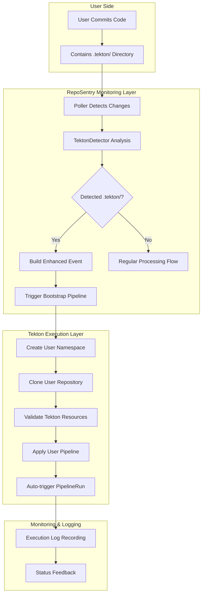
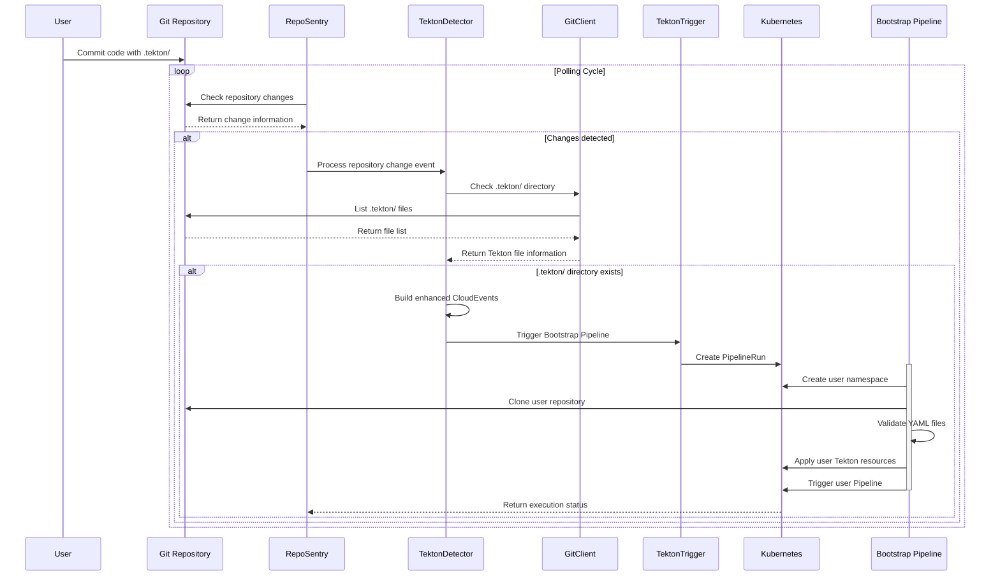
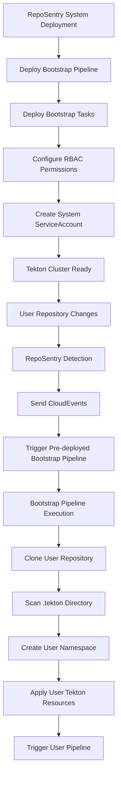

# RepoSentry Tekton Auto-Detection and Execution Architecture Design

## 🎯 Overview

This document provides a detailed description of the architecture design for RepoSentry's Tekton auto-detection and execution functionality. This feature enables users to define Tekton resource definitions in the `.tekton/` directory of their business code repositories. When code changes occur, RepoSentry automatically detects and executes these user-defined Tekton pipelines.

## 🎯 Core Functional Goals

### Current Implementation Goals
1. **Auto-Detection**: Monitor changes in the `.tekton/` directory of user repositories
2. **Transparent Execution**: Automated application and execution of Tekton resources without user awareness
3. **Configurable Paths**: Support for administrator configuration and control of detection paths
4. **Smart Discovery**: Automatically discover Tekton resources in user repositories and provide recommendations
5. **Security Isolation**: Provide independent execution environments for each user repository

### Long-term Plans
6. **Enterprise Governance**: Support hierarchical configuration management and policy governance 📋 **Long-term plan, not implemented yet**

## 🏗️ Core Design Principles

### User Transparency
- **Zero Configuration Required**: Users do not need to configure any Webhooks or settings in GitHub/GitLab
- **Completely Passive Monitoring**: Users are unaware of RepoSentry's existence and only need to commit code normally
- **Automatic Discovery Mechanism**: The system automatically detects the existence of `.tekton/` directories and processes them

### Security Isolation
- **Namespace Isolation**: Each user repository has an independent Kubernetes namespace
- **Resource Quota Limits**: Prevent individual users from consuming excessive cluster resources
- **Minimal Permissions**: Bootstrap Pipeline only has necessary minimal permissions

**Strong Isolation Details**:
- **Complete Resource Isolation**: Each repository runs in an independent namespace and cannot access other repositories' resources
- **Network Layer Isolation**: Strict control of network access through NetworkPolicy, default deny cross-namespace communication
- **Compute Resource Isolation**: ResourceQuota ensures CPU and memory usage for each repository is within controllable limits
- **Storage Isolation**: PVC and Volume mounts are limited to their own namespace
- **Identity Isolation**: Each namespace uses independent ServiceAccount and RBAC permissions

### Scalability
- **Support for Any Tekton Resources**: Pipeline, Task, PipelineRun, etc.
- **Multi-Repository Support**: Monitor multiple user repositories simultaneously
- **Flexible Trigger Strategies**: Support different processing strategies for different branches

## 🔄 Workflow Architecture

### Overall Process Flow



### Detailed Sequence Diagram



## 🚀 Bootstrap Pipeline Architecture

### Pre-deployment Infrastructure Design

#### Why Pre-deployment Instead of Dynamic Generation?

**Design Background**: The Bootstrap Pipeline serves as the core infrastructure of the RepoSentry system, pre-installed in the Tekton cluster during system deployment to avoid circular dependency issues at runtime.

**1. Solving Circular Dependencies**
```
Old Design Problem:
RepoSentry detects changes → Dynamically generate Bootstrap Pipeline → Deploy → Execute
                          ↑___________________________|
                          (Requires Pipeline to exist to trigger)

New Design Solution:
Deployment Phase: RepoSentry deployment → Deploy static Bootstrap Pipeline simultaneously → Tekton cluster ready
Runtime Phase: RepoSentry detects changes → Trigger existing Bootstrap Pipeline → Process user .tekton/
```

**2. Infrastructure as Code**
```yaml
# Bootstrap Pipeline pre-deployed as system infrastructure
apiVersion: tekton.dev/v1beta1
kind: Pipeline
metadata:
  name: reposentry-bootstrap-pipeline
  namespace: reposentry-system
spec:
  params:
  - name: repo-url
    description: "User repository URL, passed at runtime"
  - name: repo-branch
    description: "Target branch, passed at runtime"
  - name: commit-sha
    description: "Commit SHA, passed at runtime"
  tasks:
  - name: clone-user-repo
  - name: detect-tekton-resources
  - name: create-user-namespace
  - name: apply-user-tekton-resources
  - name: trigger-user-pipeline
```

**3. Parameterized Runtime Configuration**
```go
// Runtime only needs to pass parameters, no need to generate Pipeline
func TriggerBootstrapPipeline(repo Repository, commit string) {
    params := map[string]string{
        "repo-url":    repo.URL,
        "repo-branch": repo.Branch,
        "commit-sha":  commit,
    }
    // Trigger pre-deployed Bootstrap Pipeline
    tekton.CreatePipelineRun("reposentry-bootstrap-pipeline", params)
}
```

#### Pre-deployment Architecture Flow



#### Advantages of Pre-deployment

**1. Avoid Circular Dependencies**
- Bootstrap Pipeline exists before system startup
- RepoSentry only needs to trigger, not create Pipeline
- Solves the "chicken and egg" problem

**2. System Stability**
- Bootstrap Pipeline as core system component, stable and reliable
- Reduces runtime complexity and failure points
- Facilitates system monitoring and troubleshooting

**3. Parameterized Flexibility**
- Dynamic configuration through parameter passing
- Supports multi-repository concurrent processing
- Maintains single Pipeline, reduces resource consumption

#### System Component Layers

| Layer | Component | Deployment Time | Purpose |
|-------|-----------|----------------|---------|
| Infrastructure Layer | Bootstrap Pipeline | System deployment | Provides Tekton resource processing capability |
| Infrastructure Layer | Bootstrap Tasks | System deployment | Implements specific processing logic |
| Infrastructure Layer | System RBAC | System deployment | Provides necessary permission control |
| Runtime Layer | User Namespace | Pipeline runtime | Provides isolated environment for user repository |
| Runtime Layer | User Tekton Resources | Pipeline runtime | User-defined Pipeline/Task |
| Runtime Layer | User PipelineRun | Pipeline runtime | Executes user's specific workflows |

#### Deployment and Runtime Process

**Deployment Phase (One-time):**
```bash
# 1. Use static Bootstrap Pipeline YAML files
cd deployments/tekton/bootstrap/

# 2. Deploy to Tekton cluster
./install.sh
# Or manually: kubectl apply -f .

# 3. Verify deployment
kubectl get pipeline,task -n reposentry-system
```

**Runtime Phase (Continuous):**
```bash
# RepoSentry automatically executes
1. Monitor user repository changes
2. Send CloudEvents to EventListener
3. EventListener triggers Bootstrap Pipeline
4. Bootstrap Pipeline processes user .tekton/ files
```

### Overall Pipeline Design

The Bootstrap Pipeline is the core execution component of the entire architecture, responsible for:
- User environment isolation
- Secure code cloning
- Tekton resource validation
- Automatic application and triggering

### Namespace Strategy

**One Repository One Namespace Principle**:
- Each user repository is allocated an independent Kubernetes namespace for complete isolation
- Applicable Scale: Recommended for use with less than 500 repositories, performance optimization needed beyond this scale
- Cleanup Strategy: Provides manual cleanup tools, long-term plan for automatic lifecycle management

```yaml
# Namespace naming rules (semantic improvement version)
namespace: "reposentry-user-repo-{hash(owner-repo)}"

# Examples (using hash values to avoid special character issues)
# github.com/johndoe/my-app -> reposentry-user-repo-abc123def456
# gitlab.com/company/project -> reposentry-user-repo-xyz789uvw012

# Mapping relationship stored in ConfigMap:
# reposentry-namespace-mapping:
#   abc123def456: "johndoe/my-app"
#   xyz789uvw012: "company/project"
```

**Performance and Scalability Considerations**:
```yaml
# Namespace scale impact analysis
Small scale (< 100 repositories):
  Additional etcd memory: ~50MB
  API response latency: +5ms
  Impact level: Negligible
  
Medium scale (100-500 repositories):
  Additional etcd memory: ~250MB
  API response latency: +10ms
  Impact level: Slight, acceptable
  
Large scale (> 500 repositories):
  Recommendation: Evaluate performance impact, consider optimization strategies
  Monitoring: Focus on API response time and etcd memory usage
```

**Namespace Lifecycle Management**:
- **Creation Timing**: Automatically created when detecting repository contains .tekton/ directory
- **Tagging Strategy**: Add labels for creation time, last activity time, etc. to namespaces
- **Cleanup Mechanism**: Currently provides manual cleanup tools, long-term plan for automatic cleanup
- **Monitoring Metrics**: Track total namespaces, activity levels, resource usage

### Resource Quota Strategy

```yaml
apiVersion: v1
kind: ResourceQuota
metadata:
  name: tekton-quota
  namespace: reposentry-user-repo-{hash}
spec:
  hard:
    # Compute resource limits
    requests.cpu: "2"
    requests.memory: "4Gi"
    limits.cpu: "4"
    limits.memory: "8Gi"
    
    # Object quantity limits
    pods: "20"
    persistentvolumeclaims: "5"
    services: "5"
    secrets: "10"
    configmaps: "10"
    
    # Tekton specific limits
    pipelines.tekton.dev: "10"
    tasks.tekton.dev: "20"
    pipelineruns.tekton.dev: "50"
    taskruns.tekton.dev: "100"
```

### Security Policy

```yaml
apiVersion: v1
kind: NetworkPolicy
metadata:
  name: tekton-network-policy
  namespace: reposentry-user-repo-{hash}
spec:
  podSelector: {}
  policyTypes:
  - Ingress
  - Egress
  egress:
  # Allow access to Git repositories
  - to: []
    ports:
    - protocol: TCP
      port: 443  # HTTPS
    - protocol: TCP
      port: 22   # SSH
  # Allow access to container image registries
  - to: []
    ports:
    - protocol: TCP
      port: 443
```

## 🔐 Security Considerations

### Minimum Permissions

1. **RepoSentry Permissions**:
   - Read-only access to Git repositories
   - Create PipelineRun permissions
   - Manage user namespace permissions

2. **Bootstrap Pipeline Permissions**:
   - Only operate within specified namespaces
   - Cannot access other users' resources
   - Subject to resource quota limits

3. **User Pipeline Permissions**:
   - Inherit namespace security policies
   - Restricted network access
   - Cannot access cluster-level resources

### Code Security Scanning

```yaml
# Add enhanced security scanning steps in Bootstrap Pipeline
- name: security-scan
  taskSpec:
    steps:
      - name: scan-tekton-resources
        image: security-scanner:latest
        script: |
          #!/bin/bash
          set -euo pipefail
          
          echo "🔐 Starting security scan of Tekton resources..."
          
          # Scan for sensitive information
          for file in /workspace/source/.tekton/*.yaml; do
            if grep -i "password\|token\|secret\|key\|credential" "$file"; then
              echo "❌ SECURITY WARNING: Potential sensitive data in $file"
              exit 1
            fi
          done
          
          # Check dangerous configurations
          for file in /workspace/source/.tekton/*.yaml; do
            # Check privileged containers
            if grep -i "privileged.*true" "$file"; then
              echo "❌ SECURITY VIOLATION: Privileged container found in $file"
              exit 1
            fi
            
            # Check hostPath mounts
            if grep -i "hostPath" "$file"; then
              echo "❌ SECURITY VIOLATION: hostPath mount found in $file"
              exit 1
            fi
            
            # Check root user
            if grep -i "runAsUser.*0" "$file"; then
              echo "⚠️  SECURITY WARNING: Root user detected in $file"
            fi
          done
          
          echo "✅ Security scan completed successfully"
```

### Security Best Practices

#### User YAML Validation Rules
- **Prohibit privileged containers**: Prevent containers from gaining host-level privileges
- **Limit hostPath mounts**: Avoid access to host filesystem
- **Enforce resource limits**: Prevent resource exhaustion attacks
- **Prohibit access to sensitive ConfigMap/Secret**: Limit access to cluster sensitive data
- **Network policy restrictions**: Control inbound and outbound network traffic

#### Namespace Security Policies
```yaml
# Security policies automatically applied to user namespaces
apiVersion: policy/v1beta1
kind: PodSecurityPolicy
metadata:
  name: reposentry-user-psp
spec:
  privileged: false
  allowPrivilegeEscalation: false
  requiredDropCapabilities:
    - ALL
  volumes:
    - 'configMap'
    - 'emptyDir'
    - 'projected'
    - 'secret'
    - 'downwardAPI'
    - 'persistentVolumeClaim'
  runAsUser:
    rule: 'MustRunAsNonRoot'
  seLinux:
    rule: 'RunAsAny'
  fsGroup:
    rule: 'RunAsAny'
```

## 🎯 Configuration Management

### RepoSentry Configuration Extension

```yaml
# Add Tekton integration configuration to existing configuration
tekton_integration:
  enabled: true
  
  # Bootstrap Pipeline configuration
  bootstrap:
    pipeline_name: "reposentry-universal-bootstrap"
    namespace: "reposentry-system"
    timeout: "30m"
    
  # User environment configuration
  user_environments:
    namespace_prefix: "reposentry-user"
    resource_quota_template: "default-quota"
    network_policy_enabled: true
    
  # Detection configuration (fixed .tekton/ path)
  detection:
    scan_depth: 5  # Maximum scan depth for .tekton/ subdirectories
    supported_extensions: [".yaml", ".yml"]
    max_files_scan: 50
    ignore_patterns: ["*.template.*", "*/test/*"]  # Ignore patterns
    file_size_limit: "1MB"  # Single file size limit
    cache_ttl: "1h"  # Detection result cache time
    
  # Security configuration
  security:
    enable_resource_scanning: true
    max_resources_per_repo: 20
    execution_timeout: "2h"
```

### Repository-level Configuration

```yaml
# Optional: Support repository-level .reposentry.yaml configuration file
tekton:
  enabled: true
  tekton_path: ".tekton/"
  auto_trigger: true
  resource_limits:
    max_pipelines: 5
    max_parallel_runs: 2
  notifications:
    slack_webhook: "${SLACK_WEBHOOK_URL}"
    email: "admin@company.com"
```

---

## 📚 Related Documentation

- [Tekton Integration User Guide](user-guide-tekton.md)
- [Troubleshooting Guide](troubleshooting.md)
- [Architecture Design](architecture.md)
