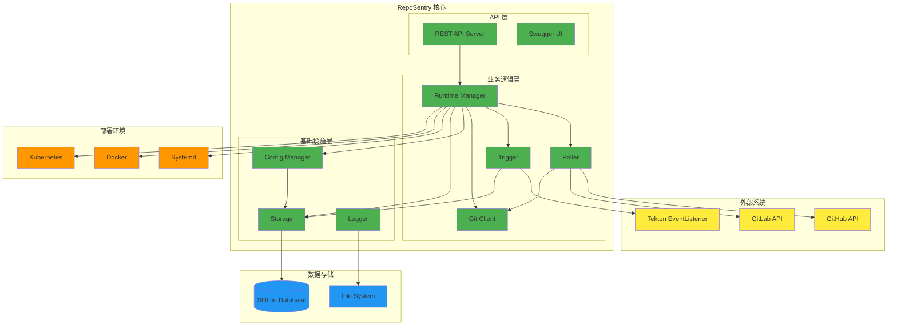
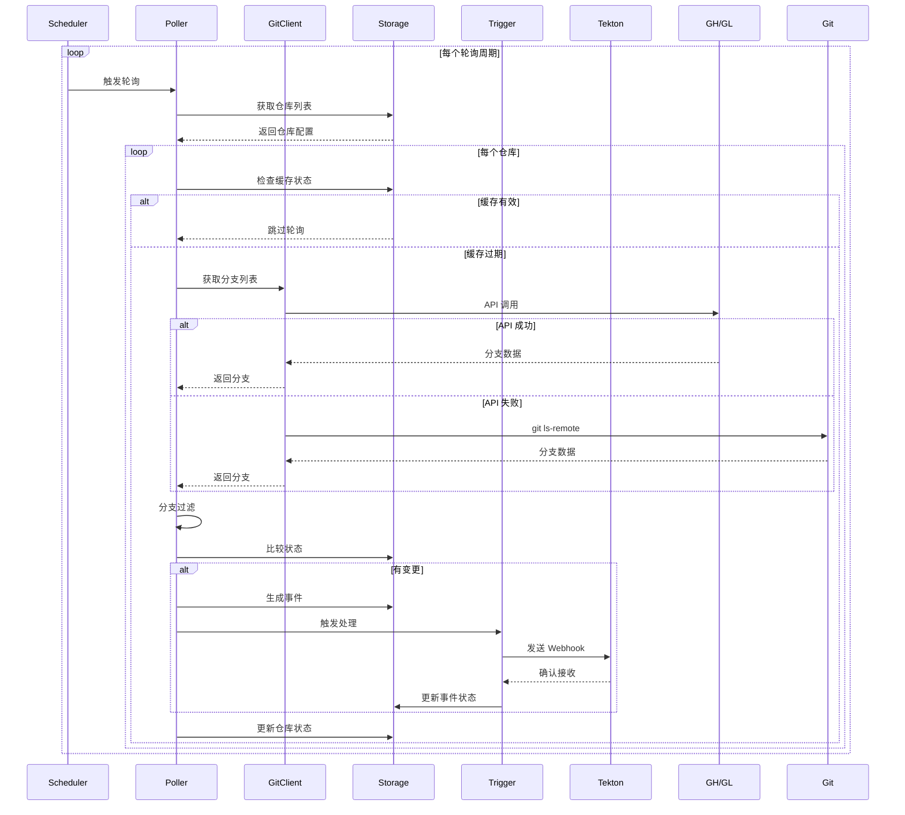
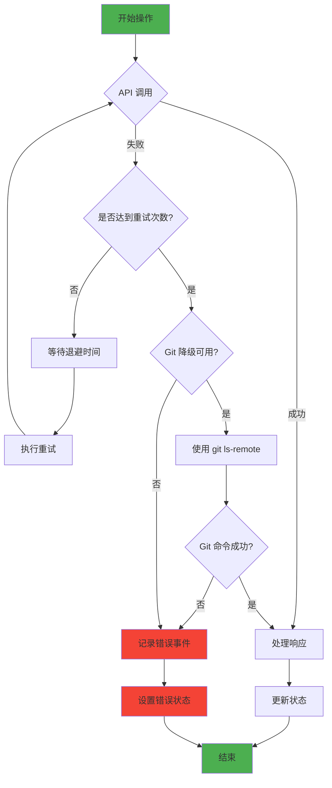
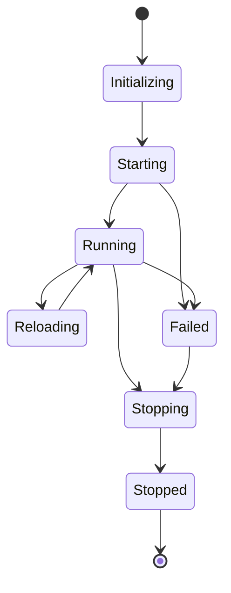
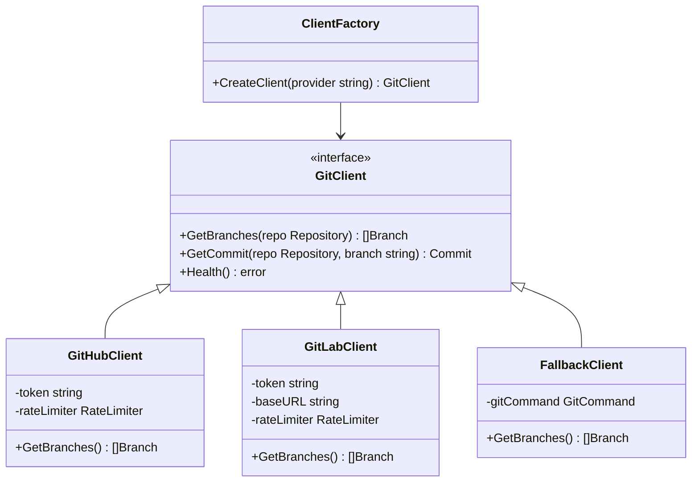
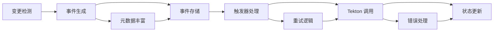
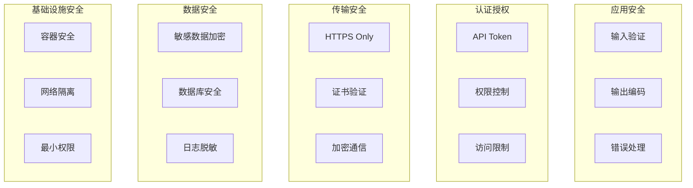
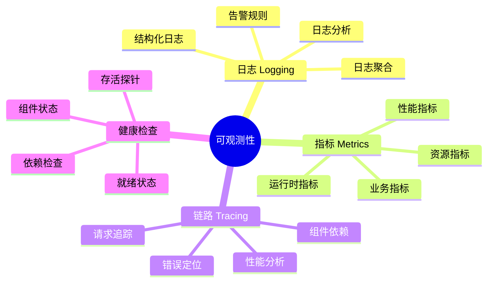
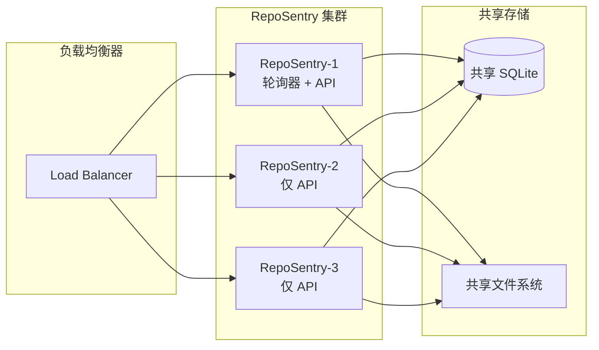
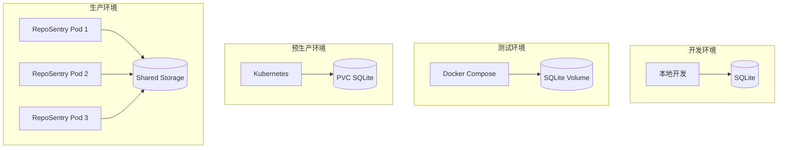

# RepoSentry 技术架构文档

## 🎯 概述

RepoSentry 是一个专为 Tekton 生态系统设计的轻量级、云原生 Git 仓库监控哨兵。采用模块化架构，支持智能轮询策略，具备高可用性和可扩展性。

## 🏗️ 系统架构

### 整体架构图



### 核心组件

#### 1. Runtime Manager（运行时管理器）
- **职责**: 组件生命周期管理、服务编排
- **功能**: 启动/停止、健康检查、依赖注入
- **接口**: `Runtime`, `Component`

#### 2. Poller（轮询器）
- **职责**: 仓库变更检测、事件生成
- **功能**: 智能轮询、分支过滤、状态缓存
- **策略**: API 优先，Git 命令降级

#### 3. Trigger（触发器）
- **职责**: 事件处理、外部系统触发
- **功能**: Tekton 集成、重试机制、幂等性保证

#### 4. Git Client（Git 客户端）
- **职责**: Git 提供商 API 封装
- **功能**: GitHub/GitLab API、速率限制、错误处理

#### 5. Storage（存储层）
- **职责**: 数据持久化、状态管理
- **功能**: SQLite 封装、数据库迁移、事务管理

#### 6. Config Manager（配置管理）
- **职责**: 配置加载、验证、热更新
- **功能**: YAML 解析、环境变量展开、配置验证

## 🔄 处理流程

### 核心工作流程



### 错误处理流程



## 🏗️ 组件设计

### 1. Runtime Manager

#### 架构设计

```go
type Runtime interface {
    Start(ctx context.Context) error
    Stop(ctx context.Context) error
    GetStatus() *RuntimeStatus
    Health() error
}

type Component interface {
    Start(ctx context.Context) error
    Stop(ctx context.Context) error
    Health() error
    Name() string
}
```

#### 组件生命周期



### 2. Poller 组件

#### 多层架构

```
┌─────────────────────────────────────┐
│           Scheduler                 │  ← 调度器：管理轮询周期
├─────────────────────────────────────┤
│        Branch Monitor               │  ← 分支监控：处理单个仓库
├─────────────────────────────────────┤
│        Event Generator              │  ← 事件生成：变更检测和事件创建
├─────────────────────────────────────┤
│         Git Client                  │  ← 客户端：API 调用和降级
└─────────────────────────────────────┘
```

#### 轮询策略

```go
type PollingStrategy interface {
    ShouldPoll(repo *Repository, lastCheck time.Time) bool
    NextPollTime(repo *Repository) time.Time
}

// 智能轮询策略
type IntelligentStrategy struct {
    baseInterval    time.Duration
    adaptiveRate    float64
    maxInterval     time.Duration
    minInterval     time.Duration
}
```

### 3. Git Client

#### 客户端架构



#### 速率限制器

```go
type RateLimiter interface {
    Allow() bool
    Wait(ctx context.Context) error
    Limit() rate.Limit
    Burst() int
}

// GitHub: 5000 requests/hour
// GitLab: 2000 requests/minute
```

### 4. Storage 层

#### 数据模型

```sql
-- 仓库状态表
CREATE TABLE repository_states (
    id INTEGER PRIMARY KEY,
    name TEXT UNIQUE NOT NULL,
    url TEXT NOT NULL,
    provider TEXT NOT NULL,
    last_checked DATETIME,
    last_commit_sha TEXT,
    branch_count INTEGER,
    status TEXT DEFAULT 'active',
    created_at DATETIME DEFAULT CURRENT_TIMESTAMP,
    updated_at DATETIME DEFAULT CURRENT_TIMESTAMP
);

-- 事件表
CREATE TABLE events (
    id TEXT PRIMARY KEY,
    repository_name TEXT NOT NULL,
    event_type TEXT NOT NULL,
    branch_name TEXT NOT NULL,
    commit_sha TEXT NOT NULL,
    status TEXT DEFAULT 'pending',
    metadata TEXT,
    error_message TEXT,
    created_at DATETIME DEFAULT CURRENT_TIMESTAMP,
    processed_at DATETIME,
    FOREIGN KEY (repository_name) REFERENCES repository_states(name)
);

-- 索引
CREATE INDEX idx_events_repository ON events(repository_name);
CREATE INDEX idx_events_created_at ON events(created_at);
CREATE INDEX idx_events_status ON events(status);
```

#### 数据库迁移

```go
type Migration struct {
    Version     int
    Name        string
    Description string
    Up          string
    Down        string
}

var migrations = []Migration{
    {
        Version: 1,
        Name:    "initial_schema",
        Up:      "CREATE TABLE repository_states...",
        Down:    "DROP TABLE repository_states;",
    },
    // ...
}
```

### 5. Event System

#### 事件类型

```go
type EventType string

const (
    EventTypeBranchCreated EventType = "branch_created"
    EventTypeBranchUpdated EventType = "branch_updated" 
    EventTypeBranchDeleted EventType = "branch_deleted"
    EventTypeCommitPushed  EventType = "commit_pushed"
)
```

#### 事件处理流水线



## 🔧 技术选型

### 核心技术栈

| 组件 | 技术选择 | 理由 |
|------|----------|------|
| **语言** | Go 1.21+ | 高性能、并发支持、云原生生态 |
| **Web框架** | Gorilla Mux | 轻量级、标准库兼容、路由灵活 |
| **数据库** | SQLite | 零依赖、嵌入式、事务支持 |
| **配置** | YAML + Viper | 人类可读、强类型、环境变量支持 |
| **日志** | Logrus | 结构化日志、多格式输出、性能优秀 |
| **HTTP客户端** | net/http | 标准库、可控制、支持上下文 |
| **容器** | Docker | 标准化、可移植、易部署 |
| **编排** | Kubernetes | 云原生、自动扩展、高可用 |

### 依赖管理

```go
// go.mod 核心依赖
module github.com/johnnynv/RepoSentry

require (
    github.com/gorilla/mux v1.8.0
    github.com/sirupsen/logrus v1.9.3
    github.com/spf13/cobra v1.7.0
    github.com/spf13/viper v1.16.0
    modernc.org/sqlite v1.25.0
    gopkg.in/natefinch/lumberjack.v2 v2.2.1
    golang.org/x/time v0.3.0
)
```

### 性能指标

| 指标 | 目标值 | 当前值 |
|------|--------|--------|
| **启动时间** | < 5s | ~2s |
| **内存使用** | < 512MB | ~128MB |
| **API 响应时间** | < 100ms | ~50ms |
| **轮询延迟** | < 30s | ~15s |
| **并发处理** | 100+ 仓库 | 测试通过 |

## 🔐 安全架构

### 安全层次



### Token 管理

```go
// Token 安全存储
type TokenManager interface {
    GetToken(provider, repo string) (string, error)
    ValidateToken(provider, token string) error
    RefreshToken(provider, repo string) error
}

// 环境变量白名单
var allowedEnvPatterns = []string{
    "*_TOKEN",
    "*_SECRET", 
    "*_PASSWORD",
    "*_KEY",
    "*_URL",
}
```

## 📊 监控架构

### 可观测性层次



### 指标收集

```go
type Metrics struct {
    // 运行时指标
    Uptime           time.Duration
    MemoryUsage      uint64
    GoroutineCount   int
    
    // 业务指标
    RepositoryCount  int
    EventCount       int64
    PollingCycles    int64
    
    // 性能指标
    AvgPollingTime   time.Duration
    APICallCount     int64
    ErrorRate        float64
    
    // API 限制指标
    GitHubRemaining  int
    GitLabRemaining  int
}
```

## 🚀 扩展性设计

### 水平扩展



### 插件架构

```go
// 插件接口
type Plugin interface {
    Name() string
    Version() string
    Init(config map[string]interface{}) error
    Execute(context.Context, Event) error
}

// 触发器插件
type TriggerPlugin interface {
    Plugin
    Trigger(event Event) error
}

// 存储插件  
type StoragePlugin interface {
    Plugin
    Store(event Event) error
    Query(filter Filter) ([]Event, error)
}
```

## 🔄 部署架构

### 多环境部署



### CI/CD 集成

```yaml
# .github/workflows/deploy.yml
name: Deploy RepoSentry

on:
  push:
    tags: ['v*']

jobs:
  test:
    runs-on: ubuntu-latest
    steps:
      - uses: actions/checkout@v3
      - name: Run tests
        run: make test-all
        
  build:
    needs: test
    runs-on: ubuntu-latest
    steps:
      - name: Build binary
        run: make build
      - name: Build Docker image
        run: docker build -t reposentry:${{ github.ref_name }} .
        
  deploy:
    needs: build
    runs-on: ubuntu-latest
    steps:
      - name: Deploy to Kubernetes
        run: |
          helm upgrade --install reposentry ./deployments/helm/reposentry \
            --set image.tag=${{ github.ref_name }}
```

## 🛠️ 开发架构

### 代码组织

```
RepoSentry/
├── cmd/reposentry/           # CLI 入口点
├── internal/                 # 内部包
│   ├── api/                 # REST API 服务器
│   ├── config/              # 配置管理
│   ├── gitclient/           # Git 客户端
│   ├── poller/              # 轮询逻辑
│   ├── runtime/             # 运行时管理
│   ├── storage/             # 存储层
│   └── trigger/             # 触发器
├── pkg/                      # 公共包
│   ├── logger/              # 日志组件
│   ├── types/               # 类型定义
│   └── utils/               # 工具函数
├── deployments/              # 部署配置
├── docs/                     # 文档
├── examples/                 # 示例配置
└── test/                     # 测试文件
```

### 设计原则

#### 1. SOLID 原则
- **单一职责**: 每个组件只负责一个功能
- **开闭原则**: 支持扩展，拒绝修改
- **里氏替换**: 接口可替换实现
- **接口隔离**: 细粒度接口设计
- **依赖倒置**: 依赖抽象，不依赖具体

#### 2. 12-Factor App
- **配置**: 环境变量和配置文件分离
- **依赖**: 明确声明和隔离依赖
- **配置**: 配置存储在环境中
- **支持服务**: 服务作为附加资源
- **日志**: 日志作为事件流处理

#### 3. 云原生原则
- **无状态**: 应用层无状态设计
- **可观测**: 健康检查、指标、日志
- **可扩展**: 水平扩展支持
- **容错**: 优雅降级和错误恢复

### 测试策略

```mermaid
pyramid
    title 测试金字塔
    
    "UI/E2E 测试" : 10
    "集成测试" : 30  
    "单元测试" : 60
```

#### 测试层次

1. **单元测试** (60%)
   - 每个函数/方法的测试
   - Mock 外部依赖
   - 快速执行，高覆盖率

2. **集成测试** (30%)
   - 组件间集成测试
   - 数据库集成测试
   - API 接口测试

3. **端到端测试** (10%)
   - 完整流程测试
   - 外部系统集成
   - 部署环境验证

## 📈 性能优化

### 轮询优化

```go
// 自适应轮询间隔
type AdaptivePoller struct {
    baseInterval    time.Duration
    maxInterval     time.Duration
    backoffFactor   float64
    activityWindow  time.Duration
}

func (p *AdaptivePoller) NextInterval(repo *Repository) time.Duration {
    // 根据仓库活跃度调整轮询间隔
    activity := p.getRecentActivity(repo)
    if activity > 0.8 {
        return p.baseInterval // 高活跃度，频繁轮询
    } else if activity < 0.2 {
        return p.maxInterval // 低活跃度，降低频率
    }
    return time.Duration(float64(p.baseInterval) * (1 + activity))
}
```

### 缓存策略

```go
type CacheStrategy interface {
    Get(key string) (interface{}, bool)
    Set(key string, value interface{}, ttl time.Duration)
    InvalidatePattern(pattern string)
}

// 分支缓存
type BranchCache struct {
    cache    map[string]CacheEntry
    ttl      time.Duration
    maxSize  int
}
```

### 数据库优化

```sql
-- 索引优化
CREATE INDEX idx_events_composite ON events(repository_name, created_at, status);
CREATE INDEX idx_repo_states_last_checked ON repository_states(last_checked) 
WHERE status = 'active';

-- 查询优化
PRAGMA journal_mode = WAL;
PRAGMA synchronous = NORMAL;
PRAGMA cache_size = 10000;
PRAGMA temp_store = memory;
```

## 🔮 未来架构演进

### 短期目标 (3-6 个月)

1. **多数据库支持**: PostgreSQL、MySQL
2. **消息队列**: Redis、RabbitMQ 集成
3. **配置热更新**: 实时配置变更
4. **指标监控**: Prometheus 集成

### 中期目标 (6-12 个月)

1. **分布式架构**: 多节点部署
2. **插件系统**: 自定义触发器
3. **Web UI**: 管理界面
4. **告警系统**: 多渠道通知

### 长期目标 (12+ 个月)

1. **AI 智能**: 智能轮询策略
2. **多云支持**: AWS、Azure、GCP
3. **GraphQL API**: 灵活查询接口
4. **微服务架构**: 服务拆分

---

## 📚 相关文档

- [快速开始指南](QUICKSTART.md)
- [用户手册](USER_MANUAL.md)
- [部署指南](../deployments/README.md)
- [开发指南](DEVELOPMENT.md)
- [API 文档](../API_EXAMPLES.md)
