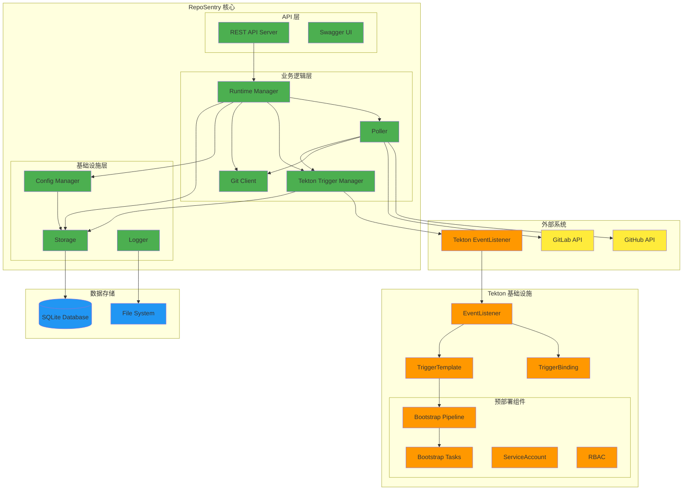
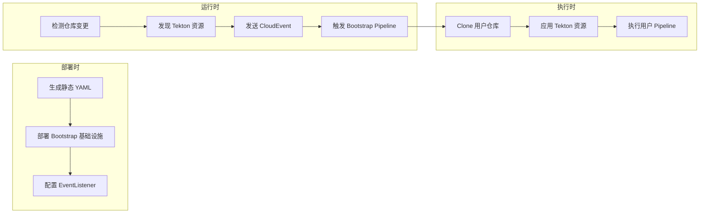
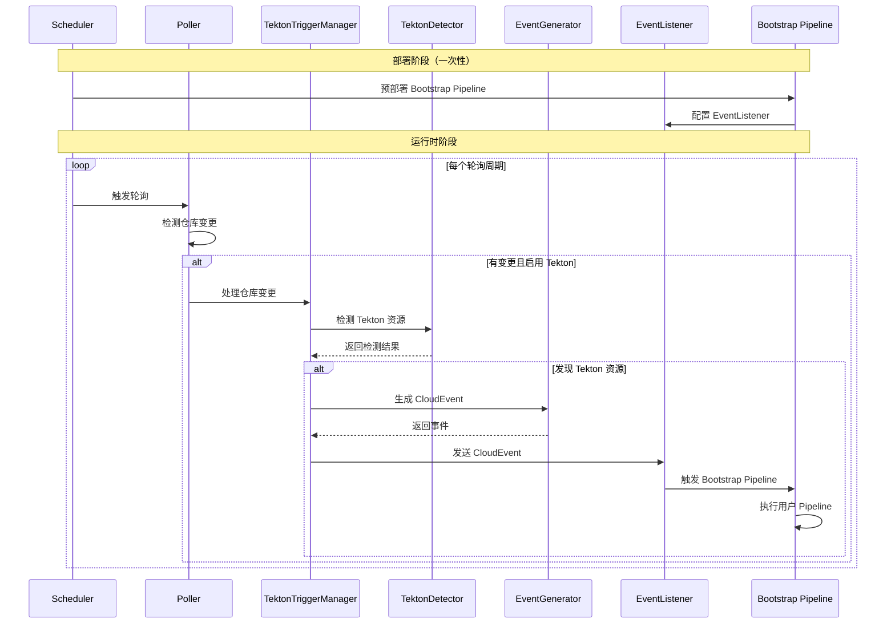
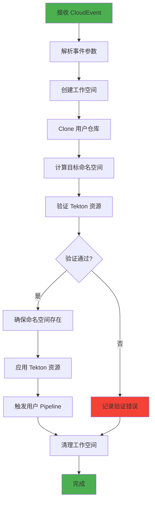
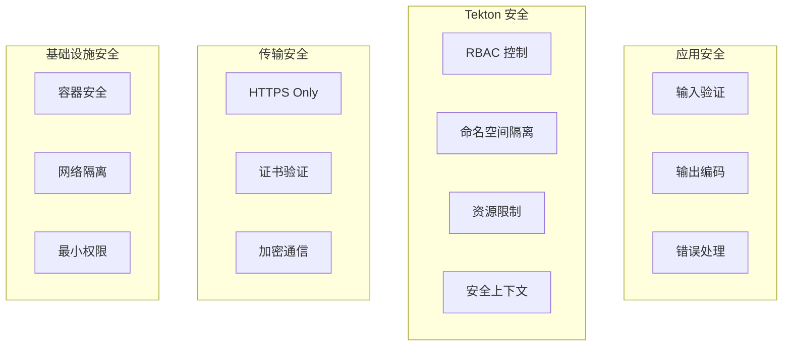
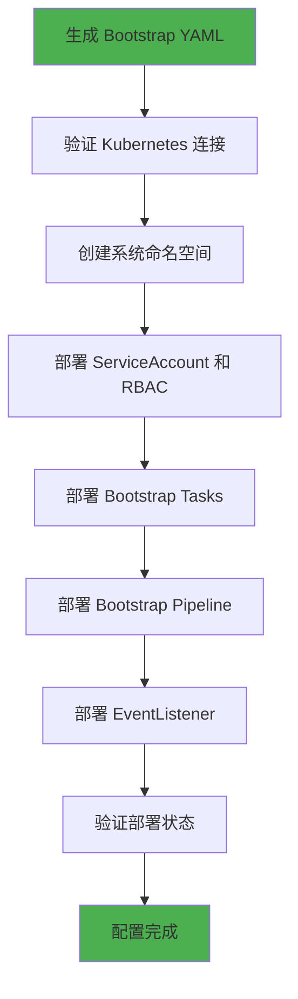

# RepoSentry 技术架构文档

## 🎯 概述

RepoSentry 是一个专为 Tekton 生态系统设计的轻量级、云原生 Git 仓库监控哨兵。采用模块化架构和预部署 Bootstrap Pipeline 设计，支持智能轮询策略，具备高可用性和可扩展性。

## 🏗️ 系统架构

### 整体架构图



### 核心组件

#### 1. Runtime Manager（运行时管理器）
- **职责**: 组件生命周期管理、服务编排
- **功能**: 启动/停止、健康检查、依赖注入
- **接口**: `Runtime`, `Component`

#### 2. Poller（轮询器）
- **职责**: 仓库变更检测、事件生成
- **功能**: 智能轮询、分支过滤、状态缓存
- **策略**: API 优先，Git 命令降级

#### 3. Tekton Trigger Manager（Tekton 触发管理器）
- **职责**: Tekton 资源检测、CloudEvent 生成
- **功能**: 检测 `.tekton` 目录、发送事件到预部署 Bootstrap Pipeline
- **特点**: 轻量级、专注于事件触发

#### 4. Git Client（Git 客户端）
- **职责**: Git 提供商 API 封装
- **功能**: GitHub/GitLab API、速率限制、错误处理

#### 5. Storage（存储层）
- **职责**: 数据持久化、状态管理
- **功能**: SQLite 封装、数据库迁移、事务管理

#### 6. Config Manager（配置管理）
- **职责**: 配置加载、验证、热更新
- **功能**: YAML 解析、环境变量展开、配置验证

## 🔄 Tekton 集成架构

### Bootstrap Pipeline 设计理念



### 预部署组件架构

```mermaid
classDiagram
    class BootstrapDeployment {
        +StaticYAMLFiles()
        +InstallScript()
        +VerifyDeployment()
        +UninstallScript()
    }
    
    class TektonTriggerManager {
        +ProcessRepositoryChange()
        +SendBootstrapEvent()
        +GetDetectionStatus()
        +IsEnabled()
    }
    
    class TektonDetector {
        +DetectTektonResources()
        +ValidateResource()
        +DetermineEstimatedAction()
    }
    
    class TektonEventGenerator {
        +GenerateDetectionEvent()
        +GenerateStandardEvent()
        +GenerateEventID()
    }
    
    TektonTriggerManager --> TektonDetector
    TektonTriggerManager --> TektonEventGenerator
    BootstrapDeployment --> "Bootstrap Infrastructure"
```

## 🔄 处理流程

### 新架构工作流程



### Bootstrap Pipeline 执行流程



## 🏗️ 组件设计

### 1. Tekton Trigger Manager

#### 设计原则
- **单一职责**: 仅负责 Tekton 集成
- **轻量级**: 最小化运行时逻辑
- **事件驱动**: 基于 CloudEvent 标准

```go
type TektonTriggerManager struct {
    detector       *TektonDetector
    eventGenerator *TektonEventGenerator
    trigger        trigger.Trigger
    logger         *logger.Entry
}

type TektonProcessRequest struct {
    Repository types.Repository
    CommitSHA  string
    Branch     string
}

type TektonProcessResult struct {
    Detection   *TektonDetection
    EventSent   bool
    Status      string
    Error       error
}
```

### 2. Static Bootstrap Generator

#### 核心功能
- **静态资源生成**: 生成可部署的 YAML 文件
- **模板化**: 使用 Go template 系统
- **配置化**: 支持自定义配置

```go
type StaticBootstrapGenerator struct {
    logger *logger.Entry
}

type StaticBootstrapConfig struct {
    SystemNamespace   string
    OutputDirectory   string
    CloneImage       string
    KubectlImage     string
    WorkspaceSize    string
    SecurityContext  map[string]interface{}
}

type StaticBootstrapOutput struct {
    Namespace      string
    Pipeline       string
    Tasks          []string
    ServiceAccount string
    Role           string
    RoleBinding    string
    FilePaths      []string
}
```

### 3. Tekton Detector

#### 检测逻辑
- **智能扫描**: 扫描 `.tekton` 目录
- **资源验证**: 验证 YAML 语法和 Tekton 规范
- **动作估算**: 根据资源类型确定执行动作

```go
type TektonDetector struct {
    gitClient gitclient.GitClient
    config    *TektonDetectorConfig
    logger    *logger.Entry
}

type TektonDetection struct {
    Repository      types.Repository
    Branch          string
    CommitSHA       string
    ScanPath        string
    Resources       []*TektonResource
    EstimatedAction string
    ProcessedAt     time.Time
}
```

## 🔧 技术选型

### 核心技术栈

| 组件 | 技术选择 | 理由 |
|------|----------|------|
| **语言** | Go 1.21+ | 高性能、并发支持、云原生生态 |
| **Web框架** | Gorilla Mux | 轻量级、标准库兼容、路由灵活 |
| **数据库** | SQLite | 零依赖、嵌入式、事务支持 |
| **配置** | YAML + Viper | 人类可读、强类型、环境变量支持 |
| **日志** | Logrus | 结构化日志、多格式输出、性能优秀 |
| **Tekton 集成** | CloudEvents | 标准化事件格式、解耦设计 |
| **容器** | Docker | 标准化、可移植、易部署 |
| **编排** | Kubernetes | 云原生、自动扩展、高可用 |

### Bootstrap Pipeline 技术栈

| 组件 | 技术选择 | 理由 |
|------|----------|------|
| **Pipeline 引擎** | Tekton Pipelines | 云原生、标准化、可扩展 |
| **事件处理** | Tekton Triggers | 事件驱动、灵活配置 |
| **工作空间** | Kubernetes PVC | 持久化、共享、可靠 |
| **镜像** | 官方 Tekton 镜像 | 稳定、安全、社区支持 |
| **RBAC** | Kubernetes RBAC | 最小权限、安全可控 |

## 🔐 安全架构

### 安全层次



### Bootstrap Pipeline 安全

```go
// 安全上下文配置
type SecurityContext struct {
    RunAsNonRoot             bool
    RunAsUser                int64
    RunAsGroup               int64
    FSGroup                  int64
    AllowPrivilegeEscalation bool
    ReadOnlyRootFilesystem   bool
}

// RBAC 配置
type RBACConfig struct {
    ServiceAccount string
    Namespace      string
    Rules          []PolicyRule
}
```

## 📊 监控架构

### 可观测性指标

```go
type TektonMetrics struct {
    // Bootstrap Pipeline 指标
    PipelineRunsTotal     int64
    PipelineRunsSuccess   int64
    PipelineRunsFailure   int64
    PipelineRunDuration   time.Duration
    
    // 检测指标
    DetectionTotal        int64
    DetectionSuccess      int64
    ResourcesDetected     int64
    
    // 事件指标
    EventsSent           int64
    EventsSuccessful     int64
    EventsFailed         int64
    
    // 性能指标
    AvgDetectionTime     time.Duration
    AvgEventSendTime     time.Duration
}
```

### 健康检查

```go
type HealthChecker interface {
    CheckTektonEnabled() error
    CheckBootstrapPipeline() error
    CheckEventListener() error
    CheckNamespaceAccess() error
}
```

## 🚀 部署架构

### Bootstrap Pipeline 部署流程



### 部署工具

```bash
# 安装 Bootstrap Pipeline
cd deployments/tekton/bootstrap/
./install.sh

# 验证部署状态
./validate.sh

# 卸载 Bootstrap Pipeline
./uninstall.sh
```

## 🔄 开发架构

### 代码组织

```
RepoSentry/
├── cmd/reposentry/              # CLI 入口点
│   ├── validate.go             # 配置验证命令
│   ├── run.go                  # 主应用程序命令
│   └── ...
├── internal/                    # 内部包
│   ├── tekton/                 # Tekton 集成
│   │   ├── trigger_manager.go     # 触发管理器
│   │   ├── detector.go            # 资源检测器
│   │   └── event_generator.go     # 事件生成器
│   ├── poller/                 # 轮询逻辑
│   └── ...
└── deployments/tekton/bootstrap/ # Bootstrap Pipeline 基础设施
    ├── install.sh             # 安装脚本
    ├── validate.sh            # 验证脚本
    └── uninstall.sh           # 卸载脚本
```

### 设计原则

#### 1. 关注点分离
- **部署时**: 静态资源生成和部署
- **运行时**: 轻量级检测和事件触发
- **执行时**: Bootstrap Pipeline 处理用户资源

#### 2. 事件驱动
- **CloudEvents**: 标准化事件格式
- **异步处理**: 非阻塞事件发送
- **解耦设计**: 组件间松耦合

#### 3. 云原生
- **容器化**: Docker 镜像打包
- **Kubernetes 原生**: 充分利用 K8s 特性
- **声明式**: YAML 配置驱动

## 📈 性能优化

### Tekton 集成优化

```go
// 检测缓存
type DetectionCache struct {
    cache map[string]*CachedDetection
    ttl   time.Duration
    mutex sync.RWMutex
}

// 事件批处理
type EventBatcher struct {
    events     []types.Event
    batchSize  int
    timeout    time.Duration
    processor  EventProcessor
}
```

### Bootstrap Pipeline 优化

- **工作空间重用**: 避免重复 Clone
- **并行任务**: 独立任务并行执行
- **资源限制**: 合理的 CPU/内存限制
- **镜像优化**: 使用轻量级镜像

## 🔮 未来架构演进

### 短期目标 (3-6 个月)

1. **多集群支持**: 跨集群 Bootstrap Pipeline
2. **高级检测**: 依赖分析、安全扫描
3. **性能监控**: Pipeline 执行指标
4. **错误恢复**: 自动重试和故障恢复

### 中期目标 (6-12 个月)

1. **GitOps 集成**: ArgoCD/Flux 支持
2. **策略引擎**: OPA 集成资源验证
3. **多租户**: 命名空间级别隔离
4. **Web UI**: Bootstrap Pipeline 管理界面

### 长期目标 (12+ 个月)

1. **AI 辅助**: 智能资源推荐
2. **服务网格**: Istio 集成
3. **跨云支持**: 多云 Tekton 集成
4. **标准化**: 成为 Tekton 生态标准工具

---

## 📚 相关文档

- [Bootstrap Pipeline 架构](bootstrap-pipeline-architecture.md)
- [用户指南 - Tekton](user-guide-tekton.md)
- [开发指南](development.md)
- [API 文档](api-examples.md)