# RepoSentry Tekton 自动检测与执行架构设计

## 🎯 概述

本文档详细描述了 RepoSentry 的 Tekton 自动检测与执行功能的架构设计。该功能使用户能够在自己的业务代码仓库中编写 `.tekton/` 目录下的 Tekton 资源定义，当代码发生变更时，RepoSentry 会自动检测并执行这些用户自定义的 Tekton 流水线。

## 🎯 核心功能目标

### 当前实施目标
1. **自动检测**：监控用户仓库中的 `.tekton/` 目录变化
2. **透明执行**：用户无感知的自动化 Tekton 资源应用和执行
3. **配置化路径**：支持管理员配置和控制检测路径
4. **智能发现**：自动发现用户仓库中的 Tekton 资源并提供建议
5. **安全隔离**：为每个用户仓库提供独立的执行环境

### 长远计划
6. **企业治理**：支持分层配置管理和策略治理 📋 **长期计划，暂不实现**

## 🏗️ 核心设计原则

### 用户透明性
- **零配置要求**：用户无需在 GitHub/GitLab 中配置任何 Webhook 或设置
- **完全被动监控**：用户不知道 RepoSentry 的存在，只需正常提交代码
- **自动发现机制**：系统自动检测 `.tekton/` 目录的存在并处理

### 安全隔离
- **命名空间隔离**：每个用户仓库拥有独立的 Kubernetes 命名空间
- **资源配额限制**：防止单个用户消耗过多集群资源
- **权限最小化**：Bootstrap Pipeline 仅拥有必要的最小权限

**强隔离性详细说明**：
- **完全资源隔离**：每个仓库在独立命名空间中运行，无法访问其他仓库的资源
- **网络层隔离**：通过NetworkPolicy严格控制网络访问，默认拒绝跨命名空间通信
- **计算资源隔离**：ResourceQuota确保每个仓库的CPU、内存使用在可控范围内
- **存储隔离**：PVC和Volume挂载仅限于自身命名空间
- **身份隔离**：每个命名空间使用独立的ServiceAccount和RBAC权限

### 可扩展性
- **支持任意 Tekton 资源**：Pipeline、Task、PipelineRun 等
- **多仓库支持**：同时监控多个用户仓库
- **灵活的触发策略**：支持不同分支的不同处理策略

## 🔄 工作流程架构

### 整体流程图

```mermaid
graph TB
    subgraph "用户侧"
        A[用户提交代码] --> B[包含 .tekton/ 目录]
    end
    
    subgraph "RepoSentry 监控层"
        C[Poller 检测变更] --> D[TektonDetector 分析]
        D --> E{检测到 .tekton/?}
        E -->|是| F[构建增强事件]
        E -->|否| G[常规处理流程]
        F --> H[触发 Bootstrap Pipeline]
    end
    
    subgraph "Tekton 执行层"
        H --> I[创建用户命名空间]
        I --> J[克隆用户仓库]
        J --> K[验证 Tekton 资源]
        K --> L[应用用户 Pipeline]
        L --> M[自动触发 PipelineRun]
    end
    
    subgraph "监控与日志"
        M --> N[执行日志记录]
        N --> O[状态反馈]
    end
    
    B --> C
```



### 详细时序图

```mermaid
sequenceDiagram
    participant User as 用户
    participant Git as Git仓库
    participant RS as RepoSentry
    participant TD as TektonDetector
    participant GC as GitClient
    participant TT as TektonTrigger
    participant K8s as Kubernetes
    participant BP as Bootstrap Pipeline
    
    User->>Git: 提交包含 .tekton/ 的代码
    
    loop 轮询周期
        RS->>Git: 检查仓库变更
        Git-->>RS: 返回变更信息
        
        alt 检测到变更
            RS->>TD: 处理仓库变更事件
            TD->>GC: 检查 .tekton/ 目录
            GC->>Git: 列出 .tekton/ 文件
            Git-->>GC: 返回文件列表
            GC-->>TD: 返回 Tekton 文件信息
            
            alt 存在 .tekton/ 目录
                TD->>TD: 构建增强 CloudEvents
                TD->>TT: 触发 Bootstrap Pipeline
                TT->>K8s: 创建 PipelineRun
                
                activate BP
                BP->>K8s: 创建用户命名空间
                BP->>Git: 克隆用户仓库
                BP->>BP: 验证 YAML 文件
                BP->>K8s: 应用用户 Tekton 资源
                BP->>K8s: 触发用户 Pipeline
                deactivate BP
                
                K8s-->>RS: 返回执行状态
            end
        end
    end
```



## 🔧 核心组件设计

### 1. TektonDetector 组件

**职责**：检测用户仓库中的 Tekton 资源并触发相应处理

```go
type TektonDetector interface {
    // 处理仓库变更事件
    ProcessRepositoryChange(repo Repository, event Event) error
    
    // 检测仓库是否包含 Tekton 资源
    DetectTektonResources(repo Repository, commitSHA string) (*TektonDetection, error)
    
    // 构建 Tekton 相关的 CloudEvents
    BuildTektonEvent(repo Repository, event Event, detection *TektonDetection) (*CloudEvent, error)
}

type TektonDetection struct {
    HasTektonDir     bool          `json:"has_tekton_dir"`
    TektonFiles      []string      `json:"tekton_files"`
    ResourceTypes    []string      `json:"resource_types"`  // Pipeline, Task, etc.
    EstimatedAction  string        `json:"estimated_action"` // apply_and_trigger, apply_only, validate_only, skip
    ValidationErrors []string      `json:"validation_errors,omitempty"`
    ScanDuration     time.Duration `json:"scan_duration"`
    SecurityWarnings []string      `json:"security_warnings,omitempty"`
}
```

**实现逻辑**：
1. **固定路径检测**：只扫描 `.tekton/` 目录及其所有子目录
2. **轻量级检测**：使用 Git API 的文件列表功能，无需克隆完整仓库  
3. **文件类型分析**：识别 Pipeline、Task、PipelineRun 等资源类型
4. **子目录支持**：支持用户在 `.tekton/` 下创建任意层级的组织结构

### 2. TektonTrigger 组件

**职责**：管理 Bootstrap Pipeline 的触发和执行

```go
type TektonTrigger interface {
    // 触发 Bootstrap Pipeline
    TriggerBootstrapPipeline(event *CloudEvent) error
    
    // 获取 Bootstrap Pipeline 状态
    GetBootstrapStatus(triggerID string) (*BootstrapStatus, error)
    
    // 管理用户命名空间
    EnsureUserNamespace(repoName string) (string, error)
}

type BootstrapStatus struct {
    Phase           string                 `json:"phase"`           // pending, running, success, failed
    StartTime       time.Time             `json:"start_time"`
    CompletionTime  *time.Time            `json:"completion_time,omitempty"`
    AppliedResources []string              `json:"applied_resources"`
    TriggeredRuns   []string              `json:"triggered_runs"`
    ErrorMessage    string                `json:"error_message,omitempty"`
}
```

### 3. 增强的 CloudEvents 格式

```json
{
  "specversion": "1.0",
  "type": "com.reposentry.tekton.detected",
  "source": "https://github.com/user/my-app",
  "id": "reposentry-tekton-abc123",
  "time": "2024-01-15T10:30:00Z",
  "datacontenttype": "application/json",
  "data": {
    "repository": {
      "name": "my-app",
      "full_name": "user/my-app",
      "url": "https://github.com/user/my-app",
      "clone_url": "https://github.com/user/my-app.git",
      "provider": "github",
      "owner": "user"
    },
    "commit": {
      "sha": "abc123def456",
      "message": "feat: add new pipeline",
      "author": {
        "name": "User Name",
        "email": "user@example.com"
      },
      "timestamp": "2024-01-15T10:25:00Z"
    },
    "branch": {
      "name": "main",
      "protected": false
    },
    "tekton": {
      "detected": true,
      "files": [
        ".tekton/pipeline.yaml",
        ".tekton/tasks/build.yaml",
        ".tekton/tasks/deploy.yaml"
      ],
      "resource_types": ["Pipeline", "Task"],
      "estimated_resources": 2,
      "action": "apply_and_trigger"
    },
    "reposentry": {
      "trigger_id": "trigger-abc123-def456",
      "detection_time": "2024-01-15T10:30:00Z",
      "version": "2.1.0"
    }
  }
}
```

## 🚀 Bootstrap Pipeline 架构

### 预部署基础设施设计

#### 为什么采用预部署而非动态生成？

**设计背景**：Bootstrap Pipeline 作为 RepoSentry 系统的核心基础设施，在系统部署时预先安装到 Tekton 集群中，避免运行时的循环依赖问题。

**1. 解决循环依赖**
```
旧设计问题：
RepoSentry检测变化 → 动态生成Bootstrap Pipeline → 部署 → 执行
                    ↑_______________________|
                    (需要Pipeline已存在才能触发)

新设计方案：
系统部署阶段：RepoSentry部署 → 同时部署静态Bootstrap Pipeline → Tekton集群就绪
运行时阶段：RepoSentry检测变化 → 触发已存在的Bootstrap Pipeline → 处理用户.tekton/
```

**2. 基础设施即代码**
```yaml
# Bootstrap Pipeline作为系统基础设施预部署
apiVersion: tekton.dev/v1beta1
kind: Pipeline
metadata:
  name: reposentry-bootstrap-pipeline
  namespace: reposentry-system
spec:
  params:
  - name: repo-url
    description: "用户仓库URL，运行时传入"
  - name: repo-branch
    description: "目标分支，运行时传入"
  - name: commit-sha
    description: "提交SHA，运行时传入"
  tasks:
  - name: clone-user-repo
  - name: detect-tekton-resources
  - name: create-user-namespace
  - name: apply-user-tekton-resources
  - name: trigger-user-pipeline
```

**3. 参数化运行时配置**
```go
// 运行时只需要传递参数，无需生成Pipeline
func TriggerBootstrapPipeline(repo Repository, commit string) {
    params := map[string]string{
        "repo-url":    repo.URL,
        "repo-branch": repo.Branch,
        "commit-sha":  commit,
    }
    // 触发预部署的Bootstrap Pipeline
    tekton.CreatePipelineRun("reposentry-bootstrap-pipeline", params)
}
```

#### 预部署架构流程

```mermaid
graph TD
    A[RepoSentry系统部署] --> B[部署Bootstrap Pipeline]
    B --> C[部署Bootstrap Tasks]
    C --> D[配置RBAC权限]
    D --> E[创建系统ServiceAccount]
    E --> F[Tekton集群就绪]
    
    F --> G[用户仓库变化]
    G --> H[RepoSentry检测]
    H --> I[发送CloudEvents]
    I --> J[触发预部署的Bootstrap Pipeline]
    J --> K[Bootstrap Pipeline执行]
    
    K --> L[克隆用户仓库]
    L --> M[扫描.tekton目录]
    M --> N[创建用户命名空间]
    N --> O[应用用户Tekton资源]
    O --> P[触发用户Pipeline]
```



#### 预部署的优势

**1. 避免循环依赖**
- Bootstrap Pipeline在系统启动前就存在
- RepoSentry只需触发，无需创建Pipeline
- 解决了"鸡生蛋，蛋生鸡"的问题

**2. 系统稳定性**
- Bootstrap Pipeline作为系统核心组件，稳定可靠
- 减少运行时的复杂度和失败点
- 便于系统监控和故障排查

**3. 参数化灵活性**
- 通过参数传递实现动态配置
- 支持多仓库并发处理
- 保持单一Pipeline，减少资源消耗

#### 系统组件分层

| 层级 | 组件 | 部署时机 | 作用 |
|------|------|----------|------|
| 基础设施层 | Bootstrap Pipeline | 系统部署时 | 提供Tekton资源处理能力 |
| 基础设施层 | Bootstrap Tasks | 系统部署时 | 实现具体的处理逻辑 |
| 基础设施层 | System RBAC | 系统部署时 | 提供必要的权限控制 |
| 运行时层 | User Namespace | Pipeline运行时 | 为用户仓库提供隔离环境 |
| 运行时层 | User Tekton Resources | Pipeline运行时 | 用户自定义的Pipeline/Task |
| 运行时层 | User PipelineRun | Pipeline运行时 | 执行用户的具体工作流 |

#### 部署和运行流程

**部署阶段（一次性）：**
```bash
# 1. 使用静态Bootstrap Pipeline YAML文件
cd deployments/tekton/bootstrap/

# 2. 部署到Tekton集群
./install.sh
# 或手动: kubectl apply -f .

# 3. 验证部署
kubectl get pipeline,task -n reposentry-system
```

**运行阶段（持续）：**
```bash
# RepoSentry自动执行
1. 监控用户仓库变化
2. 发送CloudEvents到EventListener  
3. EventListener触发Bootstrap Pipeline
4. Bootstrap Pipeline处理用户.tekton/文件
```

### Pipeline 整体设计

Bootstrap Pipeline 是整个架构的核心执行组件，负责：
- 用户环境隔离
- 代码安全克隆
- Tekton 资源验证
- 自动应用和触发

### 命名空间策略

**一仓库一命名空间原则**：
- 每个用户仓库分配独立的Kubernetes命名空间，实现完全隔离
- 适用规模：建议在500个仓库以下使用，超过此规模需考虑性能优化
- 清理策略：提供手动清理工具，长远计划实现自动生命周期管理

```yaml
# 命名空间命名规则（语义化改进版）
namespace: "reposentry-user-repo-{hash(owner-repo)}"

# 示例（使用哈希值避免特殊字符问题）
# github.com/johndoe/my-app -> reposentry-user-repo-abc123def456
# gitlab.com/company/project -> reposentry-user-repo-xyz789uvw012

# 映射关系存储在ConfigMap中：
# reposentry-namespace-mapping:
#   abc123def456: "johndoe/my-app"
#   xyz789uvw012: "company/project"
```

**性能和扩展性考虑**：
```yaml
# 命名空间规模影响分析
小规模 (< 100个仓库):
  etcd额外内存: ~50MB
  API响应延迟: +5ms
  影响程度: 可忽略
  
中等规模 (100-500个仓库):
  etcd额外内存: ~250MB
  API响应延迟: +10ms  
  影响程度: 轻微，可接受
  
大规模 (> 500个仓库):
  建议: 评估性能影响，考虑优化策略
  监控: 重点监控API响应时间和etcd内存使用
```

**命名空间生命周期管理**：
- **创建时机**：检测到仓库包含.tekton/目录时自动创建
- **标记策略**：为命名空间添加创建时间、最后活动时间等标签
- **清理机制**：当前阶段提供手动清理工具，长远计划实现自动清理
- **监控指标**：跟踪命名空间总数、活跃度、资源使用情况

### 资源配额策略

```yaml
apiVersion: v1
kind: ResourceQuota
metadata:
  name: tekton-quota
  namespace: reposentry-user-repo-{hash}
spec:
  hard:
    # 计算资源限制
    requests.cpu: "2"
    requests.memory: "4Gi"
    limits.cpu: "4"
    limits.memory: "8Gi"
    
    # 对象数量限制
    pods: "20"
    persistentvolumeclaims: "5"
    services: "5"
    secrets: "10"
    configmaps: "10"
    
    # Tekton 特定限制
    pipelines.tekton.dev: "10"
    tasks.tekton.dev: "20"
    pipelineruns.tekton.dev: "50"
    taskruns.tekton.dev: "100"
```

### 安全策略

```yaml
apiVersion: v1
kind: NetworkPolicy
metadata:
  name: tekton-network-policy
  namespace: reposentry-user-repo-{hash}
spec:
  podSelector: {}
  policyTypes:
  - Ingress
  - Egress
  egress:
  # 允许访问 Git 仓库
  - to: []
    ports:
    - protocol: TCP
      port: 443  # HTTPS
    - protocol: TCP
      port: 22   # SSH
  # 允许访问容器镜像仓库
  - to: []
    ports:
    - protocol: TCP
      port: 443
```

## 📊 监控与可观测性

### 执行状态跟踪

```go
type TektonExecution struct {
    ID               string    `json:"id"`
    RepositoryName   string    `json:"repository_name"`
    CommitSHA        string    `json:"commit_sha"`
    TriggerTime      time.Time `json:"trigger_time"`
    BootstrapStatus  string    `json:"bootstrap_status"`
    AppliedResources []string  `json:"applied_resources"`
    TriggeredRuns    []string  `json:"triggered_runs"`
    ErrorDetails     *string   `json:"error_details,omitempty"`
}
```

### API 端点扩展

```yaml
# 新增 API 端点
GET /api/v1/tekton/executions              # 获取执行历史
GET /api/v1/tekton/executions/{id}         # 获取特定执行详情
GET /api/v1/tekton/repositories/{repo}/status  # 获取仓库 Tekton 状态
POST /api/v1/tekton/repositories/{repo}/trigger # 手动触发（调试用）
```

### 日志结构

```json
{
  "timestamp": "2024-01-15T10:30:00Z",
  "level": "info",
  "component": "tekton-detector",
  "event": "tekton_resources_detected",
  "repository": "user/my-app",
  "commit_sha": "abc123",
  "tekton_files": [".tekton/pipeline.yaml"],
  "trigger_id": "trigger-abc123",
  "namespace": "reposentry-user-user-my-app"
}
```

## 🔐 安全考虑

### 权限最小化

1. **RepoSentry 权限**：
   - 只读访问 Git 仓库
   - 创建 PipelineRun 权限
   - 管理用户命名空间权限

2. **Bootstrap Pipeline 权限**：
   - 仅在指定命名空间内操作
   - 不能访问其他用户的资源
   - 受资源配额限制

3. **用户 Pipeline 权限**：
   - 继承命名空间的安全策略
   - 网络访问受限
   - 不能访问集群级别资源

### 代码安全扫描

```yaml
# 在 Bootstrap Pipeline 中添加增强的安全扫描步骤
- name: security-scan
  taskSpec:
    steps:
      - name: scan-tekton-resources
        image: security-scanner:latest
        script: |
          #!/bin/bash
          set -euo pipefail
          
          echo "🔐 Starting security scan of Tekton resources..."
          
          # 扫描敏感信息
          for file in /workspace/source/.tekton/*.yaml; do
            if grep -i "password\|token\|secret\|key\|credential" "$file"; then
              echo "❌ SECURITY WARNING: Potential sensitive data in $file"
              exit 1
            fi
          done
          
          # 检查危险配置
          for file in /workspace/source/.tekton/*.yaml; do
            # 检查privileged容器
            if grep -i "privileged.*true" "$file"; then
              echo "❌ SECURITY VIOLATION: Privileged container found in $file"
              exit 1
            fi
            
            # 检查hostPath挂载
            if grep -i "hostPath" "$file"; then
              echo "❌ SECURITY VIOLATION: hostPath mount found in $file"  
              exit 1
            fi
            
            # 检查root用户
            if grep -i "runAsUser.*0" "$file"; then
              echo "⚠️  SECURITY WARNING: Root user detected in $file"
            fi
          done
          
          echo "✅ Security scan completed successfully"
```

### 安全最佳实践

#### 用户YAML验证规则
- **禁止privileged容器**：防止容器获得主机级权限
- **限制hostPath挂载**：避免访问主机文件系统  
- **强制资源限制**：防止资源耗尽攻击
- **禁止访问敏感ConfigMap/Secret**：限制对集群敏感数据的访问
- **网络策略限制**：控制出入站网络流量

#### 命名空间安全策略
```yaml
# 自动应用到用户命名空间的安全策略
apiVersion: policy/v1beta1
kind: PodSecurityPolicy
metadata:
  name: reposentry-user-psp
spec:
  privileged: false
  allowPrivilegeEscalation: false
  requiredDropCapabilities:
    - ALL
  volumes:
    - 'configMap'
    - 'emptyDir'
    - 'projected'
    - 'secret'
    - 'downwardAPI'
    - 'persistentVolumeClaim'
  runAsUser:
    rule: 'MustRunAsNonRoot'
  seLinux:
    rule: 'RunAsAny'
  fsGroup:
    rule: 'RunAsAny'
```

## 🎯 配置管理

### RepoSentry 配置扩展

```yaml
# 在现有配置基础上添加 Tekton 集成配置
tekton_integration:
  enabled: true
  
  # Bootstrap Pipeline 配置
  bootstrap:
    pipeline_name: "reposentry-universal-bootstrap"
    namespace: "reposentry-system"
    timeout: "30m"
    
  # 用户环境配置
  user_environments:
    namespace_prefix: "reposentry-user"
    resource_quota_template: "default-quota"
    network_policy_enabled: true
    
  # 检测配置（固定 .tekton/ 路径）
  detection:
    scan_depth: 5  # .tekton/ 子目录最大扫描深度
    supported_extensions: [".yaml", ".yml"]
    max_files_scan: 50
    ignore_patterns: ["*.template.*", "*/test/*"]  # 忽略模式
    file_size_limit: "1MB"  # 单文件大小限制
    cache_ttl: "1h"  # 检测结果缓存时间
    
  # 安全配置
  security:
    enable_resource_scanning: true
    max_resources_per_repo: 20
    execution_timeout: "2h"
```

### 仓库级别配置

```yaml
# 可选：支持仓库级别的 .reposentry.yaml 配置文件
tekton:
  enabled: true
  tekton_path: ".tekton/"
  auto_trigger: true
  resource_limits:
    max_pipelines: 5
    max_parallel_runs: 2
  notifications:
    slack_webhook: "${SLACK_WEBHOOK_URL}"
    email: "admin@company.com"
```

## 📈 性能优化

### 检测优化

1. **智能缓存**：缓存仓库的 .tekton 目录检测结果
2. **增量检测**：只检测变更的文件，而非全量扫描
3. **并行处理**：多个仓库的检测可以并行进行

### 执行优化

1. **资源预热**：预创建用户命名空间模板
2. **镜像缓存**：缓存常用的构建镜像
3. **批量操作**：批量处理同一仓库的多次变更

## 🔄 故障恢复

### 重试机制

```go
type RetryConfig struct {
    MaxAttempts     int           `yaml:"max_attempts"`
    InitialDelay    time.Duration `yaml:"initial_delay"`
    MaxDelay        time.Duration `yaml:"max_delay"`
    BackoffFactor   float64       `yaml:"backoff_factor"`
}

// 默认重试配置
var DefaultRetryConfig = RetryConfig{
    MaxAttempts:   3,
    InitialDelay:  5 * time.Second,
    MaxDelay:      30 * time.Second,
    BackoffFactor: 2.0,
}
```

### 失败处理

1. **Git 克隆失败**：记录错误，标记为待重试
2. **YAML 验证失败**：记录详细错误信息，通知用户
3. **资源应用失败**：回滚已应用的资源，清理状态
4. **Pipeline 执行失败**：保留日志，提供调试信息

## 🚀 部署和运维

### 部署清单

1. **RepoSentry 核心组件升级**
2. **Bootstrap Pipeline 部署**
3. **RBAC 权限配置**
4. **监控和告警配置**
5. **网络策略部署**

### 运维监控

```yaml
# Prometheus 监控指标
reposentry_tekton_detections_total{repository, status}
reposentry_tekton_executions_total{repository, status}
reposentry_tekton_execution_duration_seconds{repository}
reposentry_tekton_bootstrap_failures_total{error_type}
reposentry_tekton_user_namespaces_total{status}
```

### 日常维护

1. **定期清理**：清理过期的 PipelineRun 和日志
2. **资源监控**：监控用户命名空间的资源使用情况
3. **权限审计**：定期审计用户权限和资源访问
4. **性能调优**：根据使用情况调整资源配额和限制

---

## 📚 相关文档

- [用户指南 - Tekton集成](user-guide-tekton.md)

- [故障排除指南](troubleshooting.md)
- [架构设计](architecture.md)

