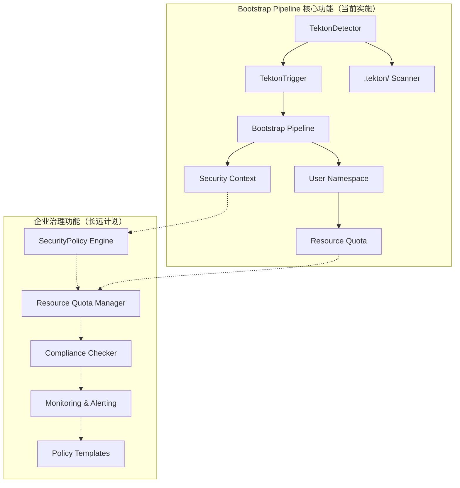
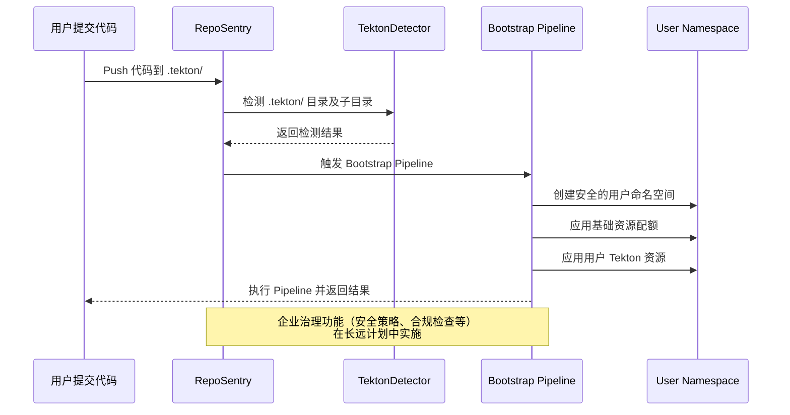

# RepoSentry Tekton 集成完整实施计划

## 🎯 项目概述

本文档提供了 RepoSentry Tekton 集成功能的实施计划，专注于 Bootstrap Pipeline 核心方案。项目采用单阶段集中开发策略，确保快速交付核心业务价值，其他高级功能作为长远计划保留。

## 📋 总体目标和功能范围

### 核心功能目标（当前实施）
1. **自动检测**：监控用户仓库中的 `.tekton/` 目录变化
2. **透明执行**：用户无感知的自动化 Tekton 资源应用和执行  
3. **安全隔离**：为每个用户仓库提供独立的执行环境

### 长远计划功能
4. **配置化路径**：支持管理员配置和控制检测路径 📋 **长期计划，暂不实现**
5. **智能发现**：自动发现用户仓库中的 Tekton 资源并提供建议 📋 **长期计划，暂不实现**
6. **企业治理**：支持分层配置管理和策略治理 📋 **长期计划，暂不实现**

### 技术约束
- 用户完全不知道 RepoSentry 的存在
- 不能要求用户配置任何 Webhook 或设置
- 必须保证安全性和资源隔离
- 需要支持 GitHub 和 GitLab 双平台

## 🗓️ 项目实施规划

| 阶段 | 时间周期 | 核心目标 | 主要交付成果 | 状态 |
|------|----------|----------|-------------|------|
| **第一阶段** | 3-4 周 | Bootstrap Pipeline 基础功能 | Tekton 自动检测和执行 | 🚀 **立即实施** |
| **第二阶段** | 2-3 周 | 企业治理功能 | 安全策略和资源管理 | 📋 **长远计划** |
| **当前重点** | **3-4 周** | **生产可用的核心功能** | **完整的 Bootstrap Pipeline** | **优先实现** |

## 🚀 第一阶段：Bootstrap Pipeline 基础功能

### 📋 阶段目标

实现基础的 Tekton 自动检测和执行功能，让用户在仓库中添加 `.tekton/` 目录后能够自动触发 Pipeline 执行。

### 🗓️ 详细开发计划

#### 第 1 周：核心组件架构

**TektonDetector 组件开发 (2人天)**
- **任务目标**：构建 Tekton 资源自动检测引擎
- **任务 1.1**：TektonDetector 组件开发
  ```go
  // 新增文件：internal/tekton/detector.go
  type TektonDetector struct {
      gitClient    gitclient.GitClient
      logger       *logger.Logger
      config       *TektonConfig
  }
  
  // 新增文件：internal/tekton/types.go
  type TektonDetection struct {
      HasTektonDir     bool          `json:"has_tekton_dir"`
      TektonFiles      []string      `json:"tekton_files"`
      ResourceTypes    []string      `json:"resource_types"`
      EstimatedAction  string        `json:"estimated_action"` // apply_and_trigger, apply_only
      // 长远计划字段（暂不实施）：
      // ValidationErrors []string      `json:"validation_errors,omitempty"`
      // ScanDuration     time.Duration `json:"scan_duration"`
      // SecurityWarnings []string      `json:"security_warnings,omitempty"`
  }
  ```

**GitClient 扩展功能实现 (2人天)**
- **任务目标**：增强 Git 客户端支持 Tekton 资源检测
- **任务 1.2**：扩展 Git 客户端功能
  ```go
  // 扩展现有 GitClient 接口
  type GitClient interface {
      // 现有方法...
      
      // 新增方法
      ListFiles(repo Repository, commitSHA, path string) ([]string, error)
      GetFileContent(repo Repository, commitSHA, filePath string) ([]byte, error)
      CheckDirectoryExists(repo Repository, commitSHA, dirPath string) (bool, error)
  }
  ```

**事件系统扩展 (1人天)**
- **任务目标**：支持 Tekton 增强 CloudEvents 格式
- **任务 1.3**：扩展事件类型和 CloudEvents 格式

#### 第 2 周：Bootstrap Pipeline 基础设施开发

**静态 Bootstrap Pipeline 生成器 (2人天)**
- **任务目标**：创建 Bootstrap Pipeline 静态 YAML 生成工具，避免运行时循环依赖
- **任务 2.1**：开发静态 Pipeline 生成器
  ```go
  // 新增文件：cmd/reposentry/generate.go
  func generateBootstrapPipelineCommand() *cobra.Command {
      // 生成静态Bootstrap Pipeline YAML文件
      // 用于系统部署时预安装到Tekton集群
  }
  
  // 新增文件：internal/tekton/static_generator.go
  type StaticBootstrapGenerator struct {
      config *BootstrapConfig
  }
  
  func (g *StaticBootstrapGenerator) GenerateStaticYAML() (*StaticBootstrapResources, error) {
      // 生成预部署的Pipeline、Tasks、RBAC等
  }
  ```

**基础设施 YAML 模板设计 (2人天)**
- **任务目标**：设计预部署的 Bootstrap Pipeline 基础设施
- **任务 2.2**：创建基础设施模板
  ```
  deployments/tekton/bootstrap/
  ├── 00-namespace.yaml              # reposentry-system 命名空间
  ├── 01-bootstrap-pipeline.yaml     # 核心Bootstrap Pipeline
  ├── 02-bootstrap-tasks/            # 预定义Tasks
  │   ├── clone-repository-task.yaml
  │   ├── detect-tekton-task.yaml
  │   ├── create-namespace-task.yaml
  │   ├── apply-resources-task.yaml
  │   └── trigger-pipeline-task.yaml
  ├── 03-rbac/                       # 系统级权限
  │   ├── system-serviceaccount.yaml
  │   ├── system-clusterrole.yaml
  │   └── system-clusterrolebinding.yaml
  ├── 04-eventlistener.yaml          # 更新的EventListener配置
  └── install.sh                     # 一键部署脚本
  ```

**用户命名空间管理 (1人天)**
- **任务目标**：实现安全的用户环境隔离和资源配额控制
- **任务 2.3**：实现用户环境隔离和资源配额
  
  **详细说明**：
  
  **命名空间隔离策略**：
  - 每个用户仓库分配独立的 Kubernetes 命名空间
  - 命名规则：`reposentry-user-repo-{hash(owner/repo)}` （使用SHA256哈希前12位）
  - 示例：`github.com/user/myapp` → `reposentry-user-repo-abc123def456`
  - 命名空间映射关系存储在ConfigMap中供查询和管理
  
  **基础资源配额控制**：
  ```yaml
  # 每个用户命名空间的资源限制
  计算资源:
    requests.cpu: "1"      # CPU请求限制
    requests.memory: "2Gi" # 内存请求限制
    limits.cpu: "2"        # CPU最大限制  
    limits.memory: "4Gi"   # 内存最大限制
  
  对象数量限制:
    pods: "5"              # 最多5个Pod
    secrets: "5"           # 最多5个Secret
    configmaps: "5"        # 最多5个ConfigMap
    
  Tekton资源限制:
    pipelines.tekton.dev: "3"        # 最多3个Pipeline
    pipelineruns.tekton.dev: "10"    # 最多10个并发PipelineRun
    tasks.tekton.dev: "10"           # 最多10个Task
  ```
  
  **网络安全隔离**：
  - 默认拒绝所有入站流量
  - 仅允许必要的出站流量：DNS(53)、HTTPS(443)、SSH(22)
  - 禁止跨命名空间通信
  
  **RBAC权限控制**：
  - 每个命名空间创建专用ServiceAccount
  - 最小权限原则：仅能管理自身命名空间内的Tekton资源
  - 禁止访问集群级别资源
  
  **性能和规模考虑**：
  - 适用范围：500个仓库以下（推荐）
  - 性能影响：每个命名空间约占用etcd 0.5MB内存
  - 监控指标：命名空间总数、API响应延迟、资源使用率
  - 清理策略：标记非活跃命名空间，提供手动清理工具
  
  **实现要点**：
  - 强制安全上下文：非root用户运行，只读根文件系统
  - 自动标签管理：为资源添加仓库、组织、创建时间等标签
  - 生命周期跟踪：记录命名空间创建、最后活动、状态变更

#### 第 3 周：系统集成和测试

**RepoSentry 触发逻辑简化 (2人天)**
- **任务目标**：简化 RepoSentry 触发逻辑，移除动态生成复杂度
- **任务 3.1**：重构触发流程
  ```go
  // 简化后的触发逻辑
  func (p *PollerImpl) processTektonChange(repo Repository, change Change) error {
      // 1. 检测.tekton目录变化
      detected := tektonDetector.DetectChanges(repo, change)
      
      // 2. 发送CloudEvents到预部署的EventListener
      event := cloudevents.NewEvent()
      event.SetType("dev.reposentry.repository.tekton_change")
      event.SetData(detected)
      
      // 3. 触发预部署的Bootstrap Pipeline（无需动态生成）
      return eventSender.Send(event)
  }
  ```

**Bootstrap Pipeline 部署和配置 (2人天)**
- **任务目标**：部署和配置 Bootstrap Pipeline 基础设施
- **任务 3.2**：部署 Bootstrap Pipeline 到测试集群
- **任务 3.3**：配置 EventListener 指向 Bootstrap Pipeline

**端到端测试 (1人天)**
- **任务目标**：验证从代码变更到用户 Pipeline 执行的完整流程
- **任务 3.4**：实现完整的端到端测试流程

#### 第 4 周：基础设施完善和生产部署

**Bootstrap Pipeline 生产化 (2人天)**
- **任务目标**：完善 Bootstrap Pipeline 基础设施，准备生产部署
- **任务 4.1**：生产级 Bootstrap Pipeline 优化
  ```yaml
  # 生产级配置示例
  apiVersion: tekton.dev/v1beta1
  kind: Pipeline
  metadata:
    name: reposentry-bootstrap-pipeline
    namespace: reposentry-system
  spec:
    params:
    - name: repo-url
    - name: repo-branch  
    - name: commit-sha
    - name: target-namespace
    tasks:
    - name: clone-user-repo
    - name: scan-tekton-directory
    - name: create-isolated-namespace
    - name: apply-user-resources
    - name: trigger-user-pipeline
  ```

**部署脚本和文档 (2人天)**
- **任务目标**：创建一键部署脚本和运维文档
- **任务 4.2**：开发部署和运维工具
  ```bash
  # 新增文件：scripts/install-bootstrap-pipeline.sh
  # 新增文件：docs/zh/bootstrap-pipeline-deployment.md
  # 新增文件：docs/zh/bootstrap-pipeline-troubleshooting.md
  ```

**监控和可观测性 (1人天)**
- **任务目标**：建立 Bootstrap Pipeline 执行监控
- **任务 4.3**：添加基础监控指标

**长远计划（暂不实施）：**
```
# 高级 API 功能（长远计划）
POST /api/v1/tekton/repositories/{repo}/configure
GET /api/v1/tekton/discovery/recommendations
GET /api/v1/tekton/governance/policies

# 高级性能优化（长远计划）  
- 智能缓存策略
- 批量检测优化
- 资源使用分析
```

### 🎯 第一阶段交付成果（生产就绪）

```
核心功能（当前实施）：
✅ 基础 Tekton 资源检测（.tekton/ 目录及子目录）
✅ 预部署的 Bootstrap Pipeline 基础设施
✅ 简化的触发机制（无循环依赖）
✅ 用户命名空间隔离和基础资源配额
✅ 安全的哈希命名空间策略
✅ 基础监控和日志记录
✅ 一键部署脚本和运维文档

基础设施能力（当前实施）：
✅ 系统级 Bootstrap Pipeline 预部署
✅ 参数化运行时配置
✅ 支持 GitHub 和 GitLab 双平台
✅ 基础并发处理
✅ 基础容错机制
✅ 基础安全策略（PodSecurityPolicy）

长远计划功能（暂不实施）：
📋 高级性能优化和智能缓存
📋 高级 API 管理功能
📋 智能子目录组织建议
📋 高级监控和告警
📋 批量仓库处理优化
```


## 📋 第二阶段：企业治理功能（长远计划）

> **📌 重要说明**：第二阶段被标记为长远计划，暂不实施。当前专注于第一阶段核心功能的完善和生产部署。

### 📋 阶段目标（未来规划）

实现企业级治理功能，确保 Tekton 资源的安全性、合规性和资源使用的可控性。
**状态：📋 暂缓实施，等待第一阶段成功部署后再考虑**

### 🗓️ 概要规划（未来参考）

> ⚠️ **注意**：以下仅为概要规划，等第一阶段完成后再详细设计

#### 主要功能模块
- **安全策略管理**：YAML安全检查、策略执行引擎
- **资源配额控制**：多层级配额管理、监控告警
- **合规性检查**：自动化审计、合规报告
- **策略模板库**：标准化配置模板和最佳实践

### 🎯 第二阶段交付成果（未来规划）

```
企业治理功能（暂缓实施）：
📋 安全策略管理
📋 资源配额控制
📋 合规性检查和审计
📋 监控告警系统
📋 策略模板库
```

## 📊 当前技术架构（第一阶段）

### 核心组件关系图



### 当前数据流（第一阶段）



## 🔧 当前配置系统（第一阶段）

### 核心配置结构

```yaml
# 第一阶段 RepoSentry Tekton 集成配置（核心功能）
tekton_integration:
  # 基础开关
  enabled: true
  
  # 检测配置（固定 .tekton/ 路径）
  detection:
    scan_depth: 3                    # .tekton/ 子目录最大扫描深度（基础）
    file_filters:
      extensions: [".yaml", ".yml"]
  
  # Bootstrap 配置
  bootstrap:
    pipeline_name: "reposentry-universal-bootstrap"
    namespace: "reposentry-system"
    timeout: "30m"
    
    # 基础安全配置
    security:
      use_hash_namespace: true       # 使用哈希命名空间
      
    # 基础资源配额
    resource_quota:
      max_cpu: "1"                   # 基础限制
      max_memory: "2Gi"              # 基础限制
      max_pods: "5"                  # 基础限制

# 长远计划配置（暂不实施）：
# detection:
#   exclude_patterns: ["*.template.*", "*/test/*", "*/examples/*"]  # 智能过滤
#   max_file_size: "1MB"            # 文件大小限制
#   cache_ttl: "1h"                 # 智能缓存
# security:
#   enable_pod_security: true       # 高级安全策略
# governance:
#   security: # 详细安全策略...
#   compliance: # 合规检查...
#   monitoring: # 高级监控...
```

## 📈 当前监控指标（第一阶段）

### 基础监控指标

```go
// 第一阶段基础 Prometheus 指标（核心功能）
var (
    // 核心功能指标
    tektonDetectionsTotal = prometheus.NewCounterVec(
        prometheus.CounterOpts{
            Name: "reposentry_tekton_detections_total",
            Help: "Total Tekton detections in .tekton/ directory",
        },
        []string{"repository", "status"},  // 简化标签
    )
    
    tektonExecutionsTotal = prometheus.NewCounterVec(
        prometheus.CounterOpts{
            Name: "reposentry_tekton_executions_total", 
            Help: "Total Tekton pipeline executions",
        },
        []string{"repository", "status"},  // 简化标签
    )
    
    bootstrapPipelineStatus = prometheus.NewGaugeVec(
        prometheus.GaugeOpts{
            Name: "reposentry_bootstrap_pipeline_status",
            Help: "Bootstrap pipeline execution status",
        },
        []string{"repository", "status"},  // 简化标签
    )
)

// 长远计划指标（暂不实施）：
// userNamespaceCount - 命名空间统计
// basicResourceUsage - 资源使用跟踪  
// securityViolationsTotal - 安全违规统计
// complianceScore - 合规性评分
// performanceMetrics - 性能指标
```

## 🧪 当前测试策略（第一阶段）

### 核心功能测试方法

```go
// 第一阶段：Bootstrap Pipeline 功能测试
func TestBootstrapPipelineBasic(t *testing.T) {
    // 测试 .tekton/ 目录检测和 Bootstrap Pipeline 执行
}

func TestTektonDirectoryScanning(t *testing.T) {
    // 测试 .tekton/ 子目录扫描（支持多层文件夹）
}

func TestUserNamespaceCreation(t *testing.T) {
    // 测试安全的哈希命名空间创建
}

func TestBasicResourceQuota(t *testing.T) {
    // 测试基础资源配额应用
}

func TestBasicSecurityContext(t *testing.T) {
    // 测试基础安全上下文和 PodSecurityPolicy
}

// 端到端集成测试
func TestTektonIntegrationE2E(t *testing.T) {
    // 测试从代码提交到 Pipeline 执行的完整流程
}

// 企业治理功能测试（长远计划 - 暂不实施）
// func TestSecurityPolicyEngine(t *testing.T) { ... }
// func TestComplianceChecking(t *testing.T) { ... }
```

## 🎯 当前成功标准（第一阶段）

### 第一阶段成功标准

| 方面 | 标准 | 状态 |
|------|------|------|
| **功能完整性** | ✅ .tekton/ 检测执行 + 子目录支持 | 🚀 **当前目标** |
| **性能要求** | 检测 < 30s，执行 < 5分钟启动 | 🚀 **当前目标** |
| **质量标准** | 覆盖率 > 90%，无高危漏洞 | 🚀 **当前目标** |
| **生产就绪度** | 基础安全 + 资源配额 | 🚀 **当前目标** |
| **企业治理** | 详细安全策略、合规检查 | 📋 **长远计划** |

### 第一阶段验收标准

```yaml
first_phase_acceptance_criteria:
  functionality:
    tekton_detection: "✅ 支持 .tekton/ 目录及所有子目录检测"
    bootstrap_pipeline: "✅ 自动应用和执行用户 Tekton 资源"
    namespace_security: "✅ 安全的哈希命名空间隔离"
    basic_resource_quotas: "✅ 基础资源配额控制"
    pod_security: "✅ PodSecurityPolicy 基础安全"
  
  performance:
    detection_time: "< 30 秒"
    execution_time: "< 5 分钟启动"
    api_response: "< 100ms"
    concurrent_repos: "支持 100+ 并发仓库"
  
  quality:
    code_coverage: "> 90%"
    integration_tests: "100% 通过"
    security_scan: "无高危漏洞"
    load_test: "支持 200+ 仓库"
  
  production_readiness:
    security: "基础安全策略和命名空间隔离"
    reliability: "99.5% 可用性"
    scalability: "支持 500+ 仓库"
    monitoring: "基础监控和日志"

# 企业治理验收标准（长远计划 - 暂不实施）
# enterprise_governance_criteria:
#   advanced_security: "详细安全策略和违规阻止"
#   compliance: "SOC2、PCI DSS 合规检查"
#   advanced_monitoring: "完整治理和审计"
#   enterprise_scalability: "支持 1000+ 仓库"
```

## 📋 当前项目管理（第一阶段）

### 资源分配（3-4周）

| 角色 | 第一阶段工作量 | 主要职责 |
|------|---------------|----------|
| **架构师** | 50% (2.0周) | Bootstrap Pipeline 设计、安全架构 |
| **后端开发** | 80% (3.2周) | TektonDetector、TektonTrigger 开发 |
| **DevOps 工程师** | 60% (2.4周) | Kubernetes 集成、命名空间配置 |
| **测试工程师** | 40% (1.6周) | 功能测试、集成测试 |
| **文档工程师** | 20% (0.8周) | 用户文档、部署指南 |

### 风险管理（第一阶段）

```yaml
first_phase_risk_management:
  technical_risks:
    - risk: ".tekton/ 目录扫描性能"
      mitigation: "实现缓存和增量扫描"
      owner: "后端开发"
      priority: "高"
    
    - risk: "命名空间哈希冲突"
      mitigation: "使用 SHA256 + 仓库 URL 确保唯一性"
      owner: "架构师"
      priority: "中"
  
  schedule_risks:
    - risk: "Bootstrap Pipeline 开发复杂"
      mitigation: "复用现有 Tekton 最佳实践和模板"
      owner: "DevOps 工程师"
      priority: "中"
    
    - risk: "Kubernetes 集成时间超预期"
      mitigation: "优先实现核心功能，安全功能分阶段"
      owner: "DevOps 工程师"
      priority: "低"
  
  scope_risks:
    - risk: "功能范围蔓延（添加企业功能）"
      mitigation: "严格遵守第一阶段边界，企业功能推迟"
      owner: "项目经理"
      priority: "高"
```

---

## 📚 当前文档结构

基于第一阶段核心功能，当前文档结构已优化完成：

### 当前文档结构
- ✅ `bootstrap-pipeline-architecture.md` (核心架构设计)
- ✅ `user-guide-tekton.md` (用户使用指南)  
- ✅ `implementation-plan.md` (本文档，第一阶段实施计划)

### 文档特点
- **聚焦核心功能**：专注于 `.tekton/` 目录检测和 Bootstrap Pipeline 执行
- **生产就绪**：包含基础安全和资源管理功能
- **实施友好**：提供详细的开发计划和明确验收标准
- **维护简单**：避免复杂的企业治理功能，降低维护成本

### 🎯 总结

通过专注第一阶段核心功能，项目具备以下优势：

1. **开发时间大幅缩短**：从 10-14 周缩短到 3-4 周
2. **技术风险显著降低**：专注核心功能，避免过度工程化
3. **快速投入生产**：基础功能完整，可立即部署使用
4. **用户体验一致**：统一的 `.tekton/` 约定，支持任意子目录组织
5. **功能边界清晰**：基础安全和资源管理已包含，企业治理功能留待未来

**📋 企业治理功能（安全策略、合规检查、高级监控等）作为长远计划保留，待第一阶段成功部署后再考虑实施。**

这个专注策略既确保了核心功能的快速交付，又为未来扩展保留了架构空间。

