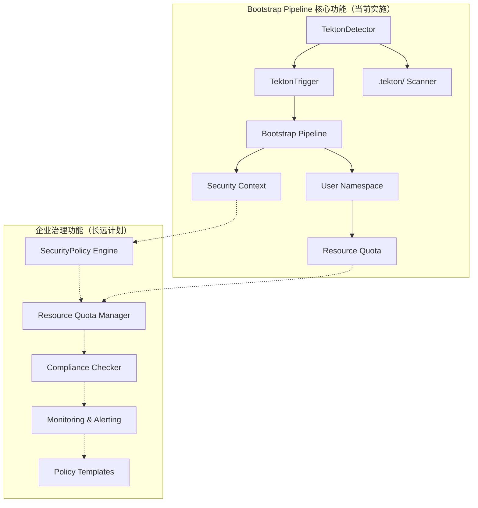
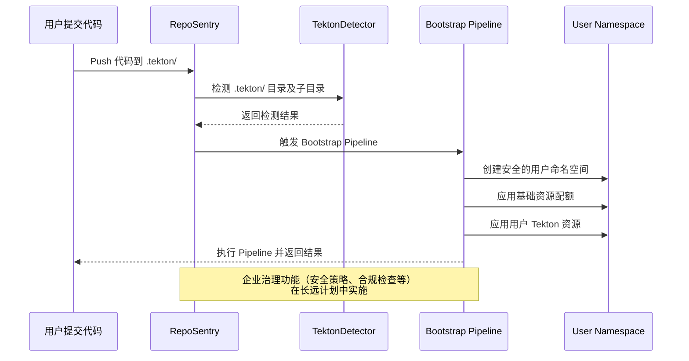

# RepoSentry Tekton 集成完整实施计划

## 🎯 项目概述

本文档提供了 RepoSentry Tekton 集成功能的完整实施计划，整合了 Bootstrap Pipeline 方案和配置化路径支持功能。项目采用四阶段渐进式开发策略，确保每个阶段都能提供独立的业务价值。

## 📋 总体目标和功能范围

### 核心功能目标
1. **自动检测**：监控用户仓库中的 `.tekton/` 目录变化
2. **透明执行**：用户无感知的自动化 Tekton 资源应用和执行  
3. **配置化路径**：支持管理员配置和控制检测路径
4. **智能发现**：自动发现用户仓库中的 Tekton 资源并提供建议
5. **安全隔离**：为每个用户仓库提供独立的执行环境
6. **企业治理**：支持分层配置管理和策略治理 (长期目标，暂不实现)

### 技术约束
- 用户完全不知道 RepoSentry 的存在
- 不能要求用户配置任何 Webhook 或设置
- 必须保证安全性和资源隔离
- 需要支持 GitHub 和 GitLab 双平台

## 🗓️ 项目实施规划

| 阶段 | 时间周期 | 核心目标 | 主要交付成果 | 状态 |
|------|----------|----------|-------------|------|
| **第一阶段** | 3-4 周 | Bootstrap Pipeline 基础功能 | Tekton 自动检测和执行 | 🚀 **立即实施** |
| **第二阶段** | 2-3 周 | 企业治理功能 | 安全策略和资源管理 | 📋 **长远计划** |
| **当前重点** | **3-4 周** | **生产可用的核心功能** | **完整的 Bootstrap Pipeline** | **优先实现** |

## 🚀 第一阶段：Bootstrap Pipeline 基础功能

### 📋 阶段目标

实现基础的 Tekton 自动检测和执行功能，让用户在仓库中添加 `.tekton/` 目录后能够自动触发 Pipeline 执行。

### 🗓️ 详细开发计划

#### 第 1 周：核心组件架构

**TektonDetector 组件开发 (2人天)**
- **任务目标**：构建 Tekton 资源自动检测引擎
- **任务 1.1**：TektonDetector 组件开发
  ```go
  // 新增文件：internal/tekton/detector.go
  type TektonDetector struct {
      gitClient    gitclient.GitClient
      logger       *logger.Logger
      config       *TektonConfig
  }
  
  // 新增文件：internal/tekton/types.go
  type TektonDetection struct {
      HasTektonDir     bool          `json:"has_tekton_dir"`
      TektonFiles      []string      `json:"tekton_files"`
      ResourceTypes    []string      `json:"resource_types"`
      EstimatedAction  string        `json:"estimated_action"` // apply_and_trigger, apply_only, validate_only, skip
      ValidationErrors []string      `json:"validation_errors,omitempty"`
      ScanDuration     time.Duration `json:"scan_duration"`
      SecurityWarnings []string      `json:"security_warnings,omitempty"`
  }
  ```

**GitClient 扩展功能实现 (2人天)**
- **任务目标**：增强 Git 客户端支持 Tekton 资源检测
- **任务 1.2**：扩展 Git 客户端功能
  ```go
  // 扩展现有 GitClient 接口
  type GitClient interface {
      // 现有方法...
      
      // 新增方法
      ListFiles(repo Repository, commitSHA, path string) ([]string, error)
      GetFileContent(repo Repository, commitSHA, filePath string) ([]byte, error)
      CheckDirectoryExists(repo Repository, commitSHA, dirPath string) (bool, error)
  }
  ```

**事件系统扩展 (1人天)**
- **任务目标**：支持 Tekton 增强 CloudEvents 格式
- **任务 1.3**：扩展事件类型和 CloudEvents 格式

#### 第 2 周：Bootstrap Pipeline 开发

**Bootstrap Pipeline YAML 设计 (2人天)**
- **任务目标**：设计通用 Bootstrap Pipeline 架构和 YAML 资源
- **任务 2.1**：设计通用 Bootstrap Pipeline
  ```
  deployments/tekton/bootstrap/
  ├── bootstrap-pipeline.yaml
  ├── bootstrap-triggerbinding.yaml  
  ├── bootstrap-triggertemplate.yaml
  ├── bootstrap-eventlistener.yaml
  ├── rbac/
  │   ├── serviceaccount.yaml
  │   ├── role.yaml
  │   └── rolebinding.yaml
  └── templates/
      ├── namespace-template.yaml
      ├── resourcequota-template.yaml
      └── networkpolicy-template.yaml
  ```

**TektonTrigger 组件开发 (2人天)**
- **任务目标**：实现 Bootstrap Pipeline 自动触发和生命周期管理
- **任务 2.2**：开发 Bootstrap Pipeline 触发器
  ```go
  // 新增文件：internal/tekton/trigger.go
  type TektonTrigger struct {
      kubeClient     kubernetes.Interface
      tektonClient   tektonclient.Interface
      eventSender    EventSender
      config         *TektonConfig
  }
  ```

**用户命名空间管理 (1人天)**
- **任务目标**：实现安全的用户环境隔离和资源配额控制
- **任务 2.3**：实现用户环境隔离和资源配额

#### 第 3 周：集成和测试

**Poller 集成 (2人天)**
- **任务目标**：将 Tekton 检测无缝集成到现有轮询架构
- **任务 3.1**：将 Tekton 检测集成到轮询流程
- **任务 3.2**：扩展 CloudEvents 格式

**端到端测试 (2人天)**
- **任务目标**：验证从代码变更到 Pipeline 执行的完整流程
- **任务 3.3**：实现完整的端到端测试流程

**监控和日志 (1人天)**
- **任务目标**：建立完整的可观测性体系，支持生产运维
- **任务 3.4**：添加监控指标和结构化日志

#### 第 4 周：文档和优化

**API 接口开发 (2人天)**
- **任务目标**：提供用户友好的 Tekton 管理和监控 API
- **任务 4.1**：开发 Tekton 相关 API 端点

**性能优化 (2人天)**
- **任务目标**：确保系统能够高效处理大规模仓库监控
- **任务 4.2**：优化检测性能和资源使用

**文档和部署 (1人天)**
- **任务目标**：完善用户文档和部署指南，确保用户能够顺利使用
- **任务 4.3**：编写用户文档和部署指南

### 🎯 第一阶段交付成果（生产就绪）

```
核心功能：
✅ 完整 Tekton 资源检测（.tekton/ 目录及所有子目录）
✅ Bootstrap Pipeline 自动触发和执行
✅ 用户命名空间隔离和基础资源配额
✅ 安全的哈希命名空间策略
✅ 监控和日志记录
✅ REST API 接口
✅ 支持任意 .tekton/ 子目录结构

生产能力：
✅ 支持 GitHub 和 GitLab 双平台
✅ 并发处理多个仓库
✅ 容错和重试机制
✅ 基础安全策略（PodSecurityPolicy）
✅ 性能优化和缓存
```


## 📋 第二阶段：企业治理功能（长远计划）

> **📌 重要说明**：第二阶段被标记为长远计划，暂不实施。当前专注于第一阶段核心功能的完善和生产部署。

### 📋 阶段目标（未来规划）

实现企业级治理功能，确保 Tekton 资源的安全性、合规性和资源使用的可控性。
**状态：📋 暂缓实施，等待第一阶段成功部署后再考虑**

### 🗓️ 详细开发计划（暂缓）

> ⚠️ **注意**：以下计划仅作为未来参考，当前不会实施

#### 未来第 5 周：安全策略和资源管理

**安全策略引擎 (3人天)**
- **任务目标**：构建用户 YAML 安全检查和策略执行引擎
- **任务 5.1**：安全策略引擎开发
  ```go
  // internal/governance/security.go
  type SecurityPolicy struct {
      ForbiddenConfigs []SecurityRule `yaml:"forbidden_configs"`
      RequiredConfigs  []SecurityRule `yaml:"required_configs"`
      WarningConfigs   []SecurityRule `yaml:"warning_configs"`
  }
  
  type SecurityRule struct {
      Name        string `yaml:"name"`
      Description string `yaml:"description"`
      Pattern     string `yaml:"pattern"`     // YAML 路径模式
      Action      string `yaml:"action"`     // block, warn, audit
  }
  ```

**资源配额管理 (2人天)**
- **任务目标**：实现多层级资源配额控制和监控
- **任务 5.2**：资源配额管理系统
  ```go
  // internal/governance/quota.go
  type ResourceQuotaPolicy struct {
      GlobalLimits      ResourceLimits            `yaml:"global_limits"`
      OrganizationLimits map[string]ResourceLimits `yaml:"organization_limits"`
      RepositoryLimits  map[string]ResourceLimits `yaml:"repository_limits"`
  }
  ```

#### 未来第 6 周：监控告警和合规检查

**监控告警系统 (2人天)**
- **任务目标**：建立企业级监控指标和告警机制
- **任务 6.1**：监控告警系统开发

**合规检查引擎 (2人天)**
- **任务目标**：实现自动化合规检查和审计功能
- **任务 6.2**：合规性检查系统

**策略模板库 (1人天)**
- **任务目标**：建立标准化策略模板和最佳实践库
- **任务 6.3**：策略模板和预设配置

#### 未来第 7 周：集成测试和文档

**企业功能集成测试 (3人天)**
- **任务目标**：验证企业治理功能的完整性和可靠性
- **任务 7.1**：端到端测试和验证

**文档和部署指南 (2人天)**
- **任务目标**：完善企业功能文档和部署指南
- **任务 7.2**：企业功能文档编写

### 🎯 第二阶段交付成果（未来规划）

```
企业治理功能（暂缓实施）：
📋 安全策略管理（禁止特权容器、硬编码密码等）
📋 资源配额控制（CPU、内存、并发执行限制）
📋 合规性检查和审计（SOC2、PCI DSS 等标准）
📋 监控告警系统（资源使用、安全违规等）
📋 策略模板库（初创公司、大企业、金融等模板）

配置示例：
# 安全策略
security_policies:
  forbidden_configs:
    - name: "privileged_containers"
      pattern: "**.securityContext.privileged"
      action: "block"
    - name: "hardcoded_secrets"
      pattern: "**.env[?(@.name =~ /.*PASSWORD.*|.*SECRET.*/)]"
      action: "block"

# 资源配额
resource_quotas:
  global_limits:
    max_cpu_request: "2"
    max_memory_request: "4Gi"
    max_pipelines: 10
    max_parallel_runs: 3
    max_execution_time: "2h"
    
  organization_limits:
    "mobile-team":
      max_cpu_request: "4"
      max_pipelines: 20
```

## 📊 当前技术架构（第一阶段）

### 核心组件关系图



### 当前数据流（第一阶段）



## 🔧 当前配置系统（第一阶段）

### 核心配置结构

```yaml
# 第一阶段 RepoSentry Tekton 集成配置
tekton_integration:
  # 基础开关
  enabled: true
  
  # 检测配置（固定 .tekton/ 路径）
  detection:
    scan_depth: 5                    # .tekton/ 子目录最大扫描深度
    file_filters:
      extensions: [".yaml", ".yml"]
      exclude_patterns: ["*.template.*", "*/test/*", "*/examples/*"]
      max_file_size: "1MB"
    cache_ttl: "1h"                  # 检测结果缓存时间
  
  # Bootstrap 配置
  bootstrap:
    pipeline_name: "reposentry-universal-bootstrap"
    namespace: "reposentry-system"
    timeout: "30m"
    
    # 基础安全配置
    security:
      use_hash_namespace: true       # 使用哈希命名空间
      enable_pod_security: true     # 启用 PodSecurityPolicy
      
    # 基础资源配额
    resource_quota:
      max_cpu: "2"
      max_memory: "4Gi"
      max_pods: "10"

# 企业治理配置（长远计划 - 暂不实施）
# governance:
#   security: # 详细安全策略...
#   compliance: # 合规检查...
#   monitoring: # 高级监控...
```

## 📈 当前监控指标（第一阶段）

### 基础监控指标

```go
// 第一阶段 Prometheus 指标
var (
    // 核心功能指标
    tektonDetectionsTotal = prometheus.NewCounterVec(
        prometheus.CounterOpts{
            Name: "reposentry_tekton_detections_total",
            Help: "Total Tekton detections in .tekton/ directory",
        },
        []string{"repository", "status", "organization"},
    )
    
    tektonExecutionsTotal = prometheus.NewCounterVec(
        prometheus.CounterOpts{
            Name: "reposentry_tekton_executions_total", 
            Help: "Total Tekton pipeline executions",
        },
        []string{"repository", "status", "organization"},
    )
    
    bootstrapPipelineStatus = prometheus.NewGaugeVec(
        prometheus.GaugeOpts{
            Name: "reposentry_bootstrap_pipeline_status",
            Help: "Bootstrap pipeline execution status",
        },
        []string{"repository", "namespace", "status"},
    )
    
    userNamespaceCount = prometheus.NewGaugeVec(
        prometheus.GaugeOpts{
            Name: "reposentry_user_namespaces_total",
            Help: "Total user namespaces created",
        },
        []string{"organization"},
    )
    
    // 基础资源使用指标
    basicResourceUsage = prometheus.NewGaugeVec(
        prometheus.GaugeOpts{
            Name: "reposentry_basic_resource_usage",
            Help: "Basic resource usage tracking",
        },
        []string{"namespace", "resource_type"},  // cpu, memory, pods
    )
)

// 企业治理指标（长远计划 - 暂不实施）
// securityViolationsTotal, complianceScore 等在未来实施
```

## 🧪 当前测试策略（第一阶段）

### 核心功能测试方法

```go
// 第一阶段：Bootstrap Pipeline 功能测试
func TestBootstrapPipelineBasic(t *testing.T) {
    // 测试 .tekton/ 目录检测和 Bootstrap Pipeline 执行
}

func TestTektonDirectoryScanning(t *testing.T) {
    // 测试 .tekton/ 子目录扫描（支持多层文件夹）
}

func TestUserNamespaceCreation(t *testing.T) {
    // 测试安全的哈希命名空间创建
}

func TestBasicResourceQuota(t *testing.T) {
    // 测试基础资源配额应用
}

func TestBasicSecurityContext(t *testing.T) {
    // 测试基础安全上下文和 PodSecurityPolicy
}

// 端到端集成测试
func TestTektonIntegrationE2E(t *testing.T) {
    // 测试从代码提交到 Pipeline 执行的完整流程
}

// 企业治理功能测试（长远计划 - 暂不实施）
// func TestSecurityPolicyEngine(t *testing.T) { ... }
// func TestComplianceChecking(t *testing.T) { ... }
```

## 🎯 当前成功标准（第一阶段）

### 第一阶段成功标准

| 方面 | 标准 | 状态 |
|------|------|------|
| **功能完整性** | ✅ .tekton/ 检测执行 + 子目录支持 | 🚀 **当前目标** |
| **性能要求** | 检测 < 30s，执行 < 5分钟启动 | 🚀 **当前目标** |
| **质量标准** | 覆盖率 > 90%，无高危漏洞 | 🚀 **当前目标** |
| **生产就绪度** | 基础安全 + 资源配额 | 🚀 **当前目标** |
| **企业治理** | 详细安全策略、合规检查 | 📋 **长远计划** |

### 第一阶段验收标准

```yaml
first_phase_acceptance_criteria:
  functionality:
    tekton_detection: "✅ 支持 .tekton/ 目录及所有子目录检测"
    bootstrap_pipeline: "✅ 自动应用和执行用户 Tekton 资源"
    namespace_security: "✅ 安全的哈希命名空间隔离"
    basic_resource_quotas: "✅ 基础资源配额控制"
    pod_security: "✅ PodSecurityPolicy 基础安全"
  
  performance:
    detection_time: "< 30 秒"
    execution_time: "< 5 分钟启动"
    api_response: "< 100ms"
    concurrent_repos: "支持 100+ 并发仓库"
  
  quality:
    code_coverage: "> 90%"
    integration_tests: "100% 通过"
    security_scan: "无高危漏洞"
    load_test: "支持 200+ 仓库"
  
  production_readiness:
    security: "基础安全策略和命名空间隔离"
    reliability: "99.5% 可用性"
    scalability: "支持 500+ 仓库"
    monitoring: "基础监控和日志"

# 企业治理验收标准（长远计划 - 暂不实施）
# enterprise_governance_criteria:
#   advanced_security: "详细安全策略和违规阻止"
#   compliance: "SOC2、PCI DSS 合规检查"
#   advanced_monitoring: "完整治理和审计"
#   enterprise_scalability: "支持 1000+ 仓库"
```

## 📋 当前项目管理（第一阶段）

### 资源分配（3-4周）

| 角色 | 第一阶段工作量 | 主要职责 |
|------|---------------|----------|
| **架构师** | 50% (2.0周) | Bootstrap Pipeline 设计、安全架构 |
| **后端开发** | 80% (3.2周) | TektonDetector、TektonTrigger 开发 |
| **DevOps 工程师** | 60% (2.4周) | Kubernetes 集成、命名空间配置 |
| **测试工程师** | 40% (1.6周) | 功能测试、集成测试 |
| **文档工程师** | 20% (0.8周) | 用户文档、部署指南 |

### 风险管理（第一阶段）

```yaml
first_phase_risk_management:
  technical_risks:
    - risk: ".tekton/ 目录扫描性能"
      mitigation: "实现缓存和增量扫描"
      owner: "后端开发"
      priority: "高"
    
    - risk: "命名空间哈希冲突"
      mitigation: "使用 SHA256 + 仓库 URL 确保唯一性"
      owner: "架构师"
      priority: "中"
  
  schedule_risks:
    - risk: "Bootstrap Pipeline 开发复杂"
      mitigation: "复用现有 Tekton 最佳实践和模板"
      owner: "DevOps 工程师"
      priority: "中"
    
    - risk: "Kubernetes 集成时间超预期"
      mitigation: "优先实现核心功能，安全功能分阶段"
      owner: "DevOps 工程师"
      priority: "低"
  
  scope_risks:
    - risk: "功能范围蔓延（添加企业功能）"
      mitigation: "严格遵守第一阶段边界，企业功能推迟"
      owner: "项目经理"
      priority: "高"
```

---

## 📚 当前文档结构

基于第一阶段核心功能，当前文档结构已优化完成：

### 当前文档结构
- ✅ `bootstrap-pipeline-architecture.md` (核心架构设计)
- ✅ `user-guide-tekton.md` (用户使用指南)  
- ✅ `implementation-plan.md` (本文档，第一阶段实施计划)

### 文档特点
- **聚焦核心功能**：专注于 `.tekton/` 目录检测和 Bootstrap Pipeline 执行
- **生产就绪**：包含基础安全和资源管理功能
- **实施友好**：提供详细的开发计划和明确验收标准
- **维护简单**：避免复杂的企业治理功能，降低维护成本

### 🎯 总结

通过专注第一阶段核心功能，项目具备以下优势：

1. **开发时间大幅缩短**：从 10-14 周缩短到 3-4 周
2. **技术风险显著降低**：专注核心功能，避免过度工程化
3. **快速投入生产**：基础功能完整，可立即部署使用
4. **用户体验一致**：统一的 `.tekton/` 约定，支持任意子目录组织
5. **功能边界清晰**：基础安全和资源管理已包含，企业治理功能留待未来

**📋 企业治理功能（安全策略、合规检查、高级监控等）作为长远计划保留，待第一阶段成功部署后再考虑实施。**

这个专注策略既确保了核心功能的快速交付，又为未来扩展保留了架构空间。

