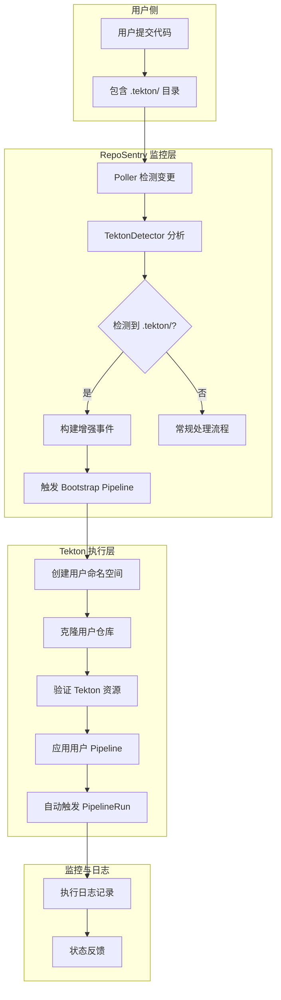
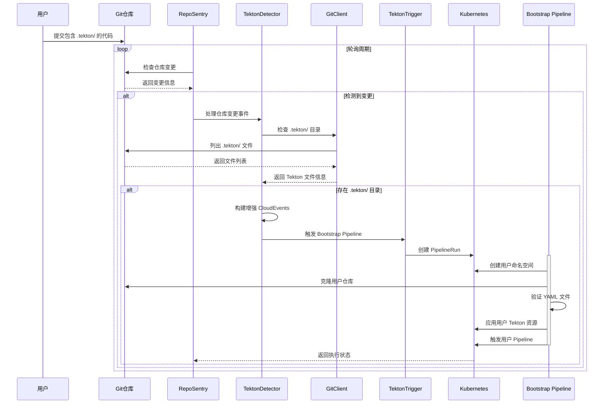

# RepoSentry Tekton 自动检测与执行架构设计

## 🎯 概述

本文档详细描述了 RepoSentry 的 Tekton 自动检测与执行功能的架构设计。该功能使用户能够在自己的业务代码仓库中编写 `.tekton/` 目录下的 Tekton 资源定义，当代码发生变更时，RepoSentry 会自动检测并执行这些用户自定义的 Tekton 流水线。

## 🏗️ 核心设计原则

### 用户透明性
- **零配置要求**：用户无需在 GitHub/GitLab 中配置任何 Webhook 或设置
- **完全被动监控**：用户不知道 RepoSentry 的存在，只需正常提交代码
- **自动发现机制**：系统自动检测 `.tekton/` 目录的存在并处理

### 安全隔离
- **命名空间隔离**：每个用户仓库拥有独立的 Kubernetes 命名空间
- **资源配额限制**：防止单个用户消耗过多集群资源
- **权限最小化**：Bootstrap Pipeline 仅拥有必要的最小权限

### 可扩展性
- **支持任意 Tekton 资源**：Pipeline、Task、PipelineRun 等
- **多仓库支持**：同时监控多个用户仓库
- **灵活的触发策略**：支持不同分支的不同处理策略

## 🔄 工作流程架构

### 整体流程图



### 详细时序图



## 🔧 核心组件设计

### 1. TektonDetector 组件

**职责**：检测用户仓库中的 Tekton 资源并触发相应处理

```go
type TektonDetector interface {
    // 处理仓库变更事件
    ProcessRepositoryChange(repo Repository, event Event) error
    
    // 检测仓库是否包含 Tekton 资源
    DetectTektonResources(repo Repository, commitSHA string) (*TektonDetection, error)
    
    // 构建 Tekton 相关的 CloudEvents
    BuildTektonEvent(repo Repository, event Event, detection *TektonDetection) (*CloudEvent, error)
}

type TektonDetection struct {
    HasTektonDir   bool     `json:"has_tekton_dir"`
    TektonFiles    []string `json:"tekton_files"`
    ResourceTypes  []string `json:"resource_types"`  // Pipeline, Task, etc.
    EstimatedAction string   `json:"estimated_action"` // apply_and_trigger, apply_only
}
```

**实现逻辑**：
1. **轻量级检测**：使用 Git API 的文件列表功能，无需克隆完整仓库
2. **文件类型分析**：识别 Pipeline、Task、PipelineRun 等资源类型
3. **智能建议**：根据资源类型建议后续处理动作

### 2. TektonTrigger 组件

**职责**：管理 Bootstrap Pipeline 的触发和执行

```go
type TektonTrigger interface {
    // 触发 Bootstrap Pipeline
    TriggerBootstrapPipeline(event *CloudEvent) error
    
    // 获取 Bootstrap Pipeline 状态
    GetBootstrapStatus(triggerID string) (*BootstrapStatus, error)
    
    // 管理用户命名空间
    EnsureUserNamespace(repoName string) (string, error)
}

type BootstrapStatus struct {
    Phase           string                 `json:"phase"`           // pending, running, success, failed
    StartTime       time.Time             `json:"start_time"`
    CompletionTime  *time.Time            `json:"completion_time,omitempty"`
    AppliedResources []string              `json:"applied_resources"`
    TriggeredRuns   []string              `json:"triggered_runs"`
    ErrorMessage    string                `json:"error_message,omitempty"`
}
```

### 3. 增强的 CloudEvents 格式

```json
{
  "specversion": "1.0",
  "type": "com.reposentry.tekton.detected",
  "source": "https://github.com/user/my-app",
  "id": "reposentry-tekton-abc123",
  "time": "2024-01-15T10:30:00Z",
  "datacontenttype": "application/json",
  "data": {
    "repository": {
      "name": "my-app",
      "full_name": "user/my-app",
      "url": "https://github.com/user/my-app",
      "clone_url": "https://github.com/user/my-app.git",
      "provider": "github",
      "owner": "user"
    },
    "commit": {
      "sha": "abc123def456",
      "message": "feat: add new pipeline",
      "author": {
        "name": "User Name",
        "email": "user@example.com"
      },
      "timestamp": "2024-01-15T10:25:00Z"
    },
    "branch": {
      "name": "main",
      "protected": false
    },
    "tekton": {
      "detected": true,
      "files": [
        ".tekton/pipeline.yaml",
        ".tekton/tasks/build.yaml",
        ".tekton/tasks/deploy.yaml"
      ],
      "resource_types": ["Pipeline", "Task"],
      "estimated_resources": 2,
      "action": "apply_and_trigger"
    },
    "reposentry": {
      "trigger_id": "trigger-abc123-def456",
      "detection_time": "2024-01-15T10:30:00Z",
      "version": "2.1.0"
    }
  }
}
```

## 🚀 Bootstrap Pipeline 架构

### Pipeline 整体设计

Bootstrap Pipeline 是整个架构的核心执行组件，负责：
- 用户环境隔离
- 代码安全克隆
- Tekton 资源验证
- 自动应用和触发

### 命名空间策略

```yaml
# 命名空间命名规则
namespace: "reposentry-user-{owner}-{repo-name}"

# 示例
# github.com/johndoe/my-app -> reposentry-user-johndoe-my-app
# gitlab.com/company/project -> reposentry-user-company-project
```

### 资源配额策略

```yaml
apiVersion: v1
kind: ResourceQuota
metadata:
  name: tekton-quota
  namespace: reposentry-user-{owner}-{repo}
spec:
  hard:
    # 计算资源限制
    requests.cpu: "2"
    requests.memory: "4Gi"
    limits.cpu: "4"
    limits.memory: "8Gi"
    
    # 对象数量限制
    pods: "20"
    persistentvolumeclaims: "5"
    services: "5"
    secrets: "10"
    configmaps: "10"
    
    # Tekton 特定限制
    pipelines.tekton.dev: "10"
    tasks.tekton.dev: "20"
    pipelineruns.tekton.dev: "50"
    taskruns.tekton.dev: "100"
```

### 安全策略

```yaml
apiVersion: v1
kind: NetworkPolicy
metadata:
  name: tekton-network-policy
  namespace: reposentry-user-{owner}-{repo}
spec:
  podSelector: {}
  policyTypes:
  - Ingress
  - Egress
  egress:
  # 允许访问 Git 仓库
  - to: []
    ports:
    - protocol: TCP
      port: 443  # HTTPS
    - protocol: TCP
      port: 22   # SSH
  # 允许访问容器镜像仓库
  - to: []
    ports:
    - protocol: TCP
      port: 443
```

## 📊 监控与可观测性

### 执行状态跟踪

```go
type TektonExecution struct {
    ID               string    `json:"id"`
    RepositoryName   string    `json:"repository_name"`
    CommitSHA        string    `json:"commit_sha"`
    TriggerTime      time.Time `json:"trigger_time"`
    BootstrapStatus  string    `json:"bootstrap_status"`
    AppliedResources []string  `json:"applied_resources"`
    TriggeredRuns    []string  `json:"triggered_runs"`
    ErrorDetails     *string   `json:"error_details,omitempty"`
}
```

### API 端点扩展

```yaml
# 新增 API 端点
GET /api/v1/tekton/executions              # 获取执行历史
GET /api/v1/tekton/executions/{id}         # 获取特定执行详情
GET /api/v1/tekton/repositories/{repo}/status  # 获取仓库 Tekton 状态
POST /api/v1/tekton/repositories/{repo}/trigger # 手动触发（调试用）
```

### 日志结构

```json
{
  "timestamp": "2024-01-15T10:30:00Z",
  "level": "info",
  "component": "tekton-detector",
  "event": "tekton_resources_detected",
  "repository": "user/my-app",
  "commit_sha": "abc123",
  "tekton_files": [".tekton/pipeline.yaml"],
  "trigger_id": "trigger-abc123",
  "namespace": "reposentry-user-user-my-app"
}
```

## 🔐 安全考虑

### 权限最小化

1. **RepoSentry 权限**：
   - 只读访问 Git 仓库
   - 创建 PipelineRun 权限
   - 管理用户命名空间权限

2. **Bootstrap Pipeline 权限**：
   - 仅在指定命名空间内操作
   - 不能访问其他用户的资源
   - 受资源配额限制

3. **用户 Pipeline 权限**：
   - 继承命名空间的安全策略
   - 网络访问受限
   - 不能访问集群级别资源

### 代码安全扫描

```yaml
# 在 Bootstrap Pipeline 中添加安全扫描步骤
- name: security-scan
  taskSpec:
    steps:
      - name: scan-tekton-resources
        image: security-scanner:latest
        script: |
          # 扫描 YAML 文件中的敏感信息
          for file in /workspace/source/.tekton/*.yaml; do
            # 检查硬编码的密码、令牌等
            if grep -i "password\|token\|secret" "$file"; then
              echo "WARNING: Potential sensitive data in $file"
            fi
          done
```

## 🎯 配置管理

### RepoSentry 配置扩展

```yaml
# 在现有配置基础上添加 Tekton 集成配置
tekton_integration:
  enabled: true
  
  # Bootstrap Pipeline 配置
  bootstrap:
    pipeline_name: "reposentry-universal-bootstrap"
    namespace: "reposentry-system"
    timeout: "30m"
    
  # 用户环境配置
  user_environments:
    namespace_prefix: "reposentry-user"
    resource_quota_template: "default-quota"
    network_policy_enabled: true
    
  # 检测配置
  detection:
    tekton_paths: [".tekton/", ".tekton/pipelines/", ".tekton/tasks/"]
    supported_extensions: [".yaml", ".yml"]
    max_files_scan: 50
    
  # 安全配置
  security:
    enable_resource_scanning: true
    max_resources_per_repo: 20
    execution_timeout: "2h"
```

### 仓库级别配置

```yaml
# 可选：支持仓库级别的 .reposentry.yaml 配置文件
tekton:
  enabled: true
  tekton_path: ".tekton/"
  auto_trigger: true
  resource_limits:
    max_pipelines: 5
    max_parallel_runs: 2
  notifications:
    slack_webhook: "${SLACK_WEBHOOK_URL}"
    email: "admin@company.com"
```

## 📈 性能优化

### 检测优化

1. **智能缓存**：缓存仓库的 .tekton 目录检测结果
2. **增量检测**：只检测变更的文件，而非全量扫描
3. **并行处理**：多个仓库的检测可以并行进行

### 执行优化

1. **资源预热**：预创建用户命名空间模板
2. **镜像缓存**：缓存常用的构建镜像
3. **批量操作**：批量处理同一仓库的多次变更

## 🔄 故障恢复

### 重试机制

```go
type RetryConfig struct {
    MaxAttempts     int           `yaml:"max_attempts"`
    InitialDelay    time.Duration `yaml:"initial_delay"`
    MaxDelay        time.Duration `yaml:"max_delay"`
    BackoffFactor   float64       `yaml:"backoff_factor"`
}

// 默认重试配置
var DefaultRetryConfig = RetryConfig{
    MaxAttempts:   3,
    InitialDelay:  5 * time.Second,
    MaxDelay:      30 * time.Second,
    BackoffFactor: 2.0,
}
```

### 失败处理

1. **Git 克隆失败**：记录错误，标记为待重试
2. **YAML 验证失败**：记录详细错误信息，通知用户
3. **资源应用失败**：回滚已应用的资源，清理状态
4. **Pipeline 执行失败**：保留日志，提供调试信息

## 🚀 部署和运维

### 部署清单

1. **RepoSentry 核心组件升级**
2. **Bootstrap Pipeline 部署**
3. **RBAC 权限配置**
4. **监控和告警配置**
5. **网络策略部署**

### 运维监控

```yaml
# Prometheus 监控指标
reposentry_tekton_detections_total{repository, status}
reposentry_tekton_executions_total{repository, status}
reposentry_tekton_execution_duration_seconds{repository}
reposentry_tekton_bootstrap_failures_total{error_type}
reposentry_tekton_user_namespaces_total{status}
```

### 日常维护

1. **定期清理**：清理过期的 PipelineRun 和日志
2. **资源监控**：监控用户命名空间的资源使用情况
3. **权限审计**：定期审计用户权限和资源访问
4. **性能调优**：根据使用情况调整资源配额和限制

---

## 📚 相关文档

- [Tekton 集成用户指南](tekton-integration-user-guide.md)
- [Bootstrap Pipeline 开发指南](tekton-bootstrap-development.md)
- [安全最佳实践](tekton-security-best-practices.md)
- [故障排除指南](tekton-troubleshooting.md)

