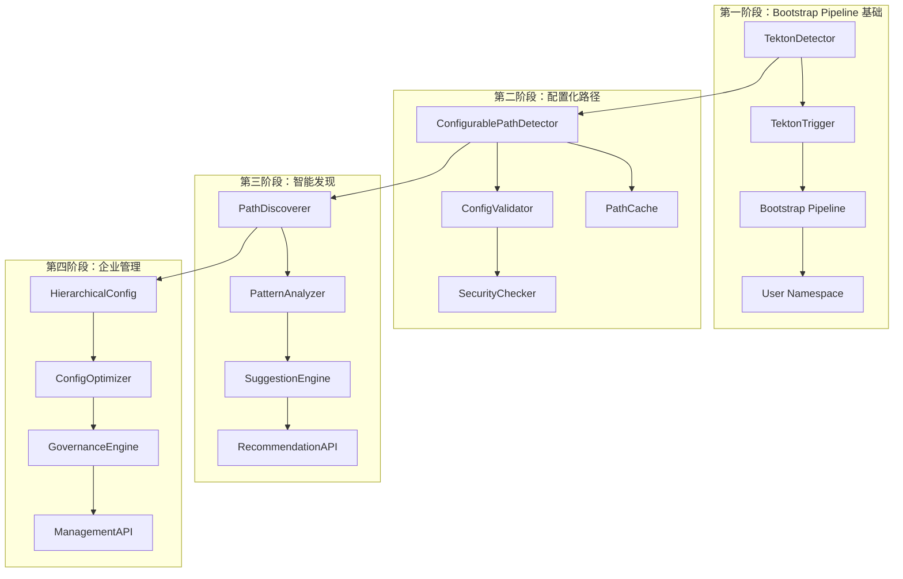
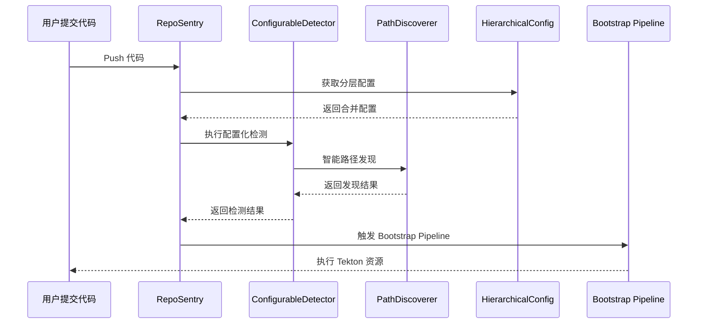

# RepoSentry Tekton 集成完整实施计划

## 🎯 项目概述

本文档提供了 RepoSentry Tekton 集成功能的完整实施计划，整合了 Bootstrap Pipeline 方案和配置化路径支持功能。项目采用四阶段渐进式开发策略，确保每个阶段都能提供独立的业务价值。

## 📋 总体目标和功能范围

### 核心功能目标
1. **自动检测**：监控用户仓库中的 `.tekton/` 目录变化
2. **透明执行**：用户无感知的自动化 Tekton 资源应用和执行  
3. **配置化路径**：支持管理员配置和控制检测路径
4. **智能发现**：自动发现用户仓库中的 Tekton 资源并提供建议
5. **安全隔离**：为每个用户仓库提供独立的执行环境
6. **企业治理**：支持分层配置管理和策略治理

### 技术约束
- 用户完全不知道 RepoSentry 的存在
- 不能要求用户配置任何 Webhook 或设置
- 必须保证安全性和资源隔离
- 需要支持 GitHub 和 GitLab 双平台

## 🗓️ 四阶段总体时间规划

| 阶段 | 时间周期 | 核心目标 | 主要交付成果 |
|------|----------|----------|-------------|
| **第一阶段** | 3-4 周 | Bootstrap Pipeline 基础功能 | Tekton 自动检测和执行 |
| **第二阶段** | 2-3 周 | 配置化路径支持 | 可配置的路径检测功能 |
| **第三阶段** | 2-3 周 | 智能路径发现 | 路径发现和建议系统 |
| **第四阶段** | 3-4 周 | 企业级配置管理 | 分层配置和治理功能 |
| **总计** | 10-14 周 | 完整的企业级 Tekton 集成 | 生产就绪的功能 |

## 🚀 第一阶段：Bootstrap Pipeline 基础功能

### 📋 阶段目标

实现基础的 Tekton 自动检测和执行功能，让用户在仓库中添加 `.tekton/` 目录后能够自动触发 Pipeline 执行。

### 🗓️ 详细开发计划

#### 第 1 周：核心组件架构

**周一-周二：基础架构设计**
- **任务 1.1**：TektonDetector 组件开发
  ```go
  // 新增文件：internal/tekton/detector.go
  type TektonDetector struct {
      gitClient    gitclient.GitClient
      logger       *logger.Logger
      config       *TektonConfig
  }
  
  // 新增文件：internal/tekton/types.go
  type TektonDetection struct {
      HasTektonDir    bool     `json:"has_tekton_dir"`
      TektonFiles     []string `json:"tekton_files"`
      ResourceTypes   []string `json:"resource_types"`
      EstimatedAction string   `json:"estimated_action"`
  }
  ```

**周三-周四：GitClient 扩展**
- **任务 1.2**：扩展 Git 客户端功能
  ```go
  // 扩展现有 GitClient 接口
  type GitClient interface {
      // 现有方法...
      
      // 新增方法
      ListFiles(repo Repository, commitSHA, path string) ([]string, error)
      GetFileContent(repo Repository, commitSHA, filePath string) ([]byte, error)
      CheckDirectoryExists(repo Repository, commitSHA, dirPath string) (bool, error)
  }
  ```

**周五：事件系统扩展**
- **任务 1.3**：扩展事件类型和 CloudEvents 格式

#### 第 2 周：Bootstrap Pipeline 开发

**周一-周二：Bootstrap Pipeline YAML 设计**
- **任务 2.1**：设计通用 Bootstrap Pipeline
  ```
  deployments/tekton/bootstrap/
  ├── bootstrap-pipeline.yaml
  ├── bootstrap-triggerbinding.yaml  
  ├── bootstrap-triggertemplate.yaml
  ├── bootstrap-eventlistener.yaml
  ├── rbac/
  │   ├── serviceaccount.yaml
  │   ├── role.yaml
  │   └── rolebinding.yaml
  └── templates/
      ├── namespace-template.yaml
      ├── resourcequota-template.yaml
      └── networkpolicy-template.yaml
  ```

**周三-周四：TektonTrigger 组件开发**
- **任务 2.2**：开发 Bootstrap Pipeline 触发器
  ```go
  // 新增文件：internal/tekton/trigger.go
  type TektonTrigger struct {
      kubeClient     kubernetes.Interface
      tektonClient   tektonclient.Interface
      eventSender    EventSender
      config         *TektonConfig
  }
  ```

**周五：用户命名空间管理**
- **任务 2.3**：实现用户环境隔离和资源配额

#### 第 3 周：集成和测试

**周一-周二：Poller 集成**
- **任务 3.1**：将 Tekton 检测集成到轮询流程
- **任务 3.2**：扩展 CloudEvents 格式

**周三-周四：端到端测试**
- **任务 3.3**：实现完整的端到端测试流程

**周五：监控和日志**
- **任务 3.4**：添加监控指标和结构化日志

#### 第 4 周：文档和优化

**周一-周二：API 接口**
- **任务 4.1**：开发 Tekton 相关 API 端点

**周三-周四：性能优化**
- **任务 4.2**：优化检测性能和资源使用

**周五：文档和部署**
- **任务 4.3**：编写用户文档和部署指南

### 🎯 第一阶段交付成果

```
核心功能：
✅ 基础 Tekton 资源检测（仅支持 .tekton/ 根目录）
✅ Bootstrap Pipeline 自动触发和执行
✅ 用户命名空间隔离和资源配额
✅ 基础监控和日志记录
✅ REST API 接口

技术债务：
⚠️  仅支持 .tekton/ 根目录，不支持子目录
⚠️  配置硬编码，缺乏灵活性
⚠️  缺少智能路径发现功能
```

## 🔧 第二阶段：配置化路径支持

### 📋 阶段目标

在第一阶段基础上，添加配置化路径支持，让管理员能够通过配置文件精确控制支持的 Tekton 资源路径。

### 🗓️ 详细开发计划

#### 第 5 周：配置系统重构

**周一-周二：配置结构设计**
- **任务 5.1**：扩展配置类型定义
  ```go
  // pkg/types/tekton.go - 新增配置结构
  type TektonIntegrationConfig struct {
      Enabled   bool                   `yaml:"enabled" json:"enabled"`
      Detection TektonDetectionConfig  `yaml:"detection" json:"detection"`
      Bootstrap BootstrapConfig        `yaml:"bootstrap" json:"bootstrap"`
      Security  TektonSecurityConfig   `yaml:"security" json:"security"`
  }
  
  type TektonDetectionConfig struct {
      Mode         DetectionMode `yaml:"mode" json:"mode"`
      TektonPaths  []string      `yaml:"tekton_paths" json:"tekton_paths"`
      FileFilters  FileFilterConfig `yaml:"file_filters" json:"file_filters"`
      MaxFiles     int              `yaml:"max_files" json:"max_files"`
      Timeout      time.Duration    `yaml:"timeout" json:"timeout"`
  }
  ```

**周三-周四：检测器重构**
- **任务 5.2**：重构 TektonDetector 支持配置化路径
  ```go
  // internal/tekton/detector.go - 重构为 ConfigurablePathDetector
  type ConfigurablePathDetector struct {
      gitClient    gitclient.GitClient
      config       *TektonDetectionConfig
      logger       *logger.Logger
      pathCache    *PathCache
  }
  ```

**周五：配置验证系统**
- **任务 5.3**：实现配置验证和安全检查

#### 第 6 周：缓存和性能优化

**周一-周二：缓存机制**
- **任务 6.1**：实现智能缓存系统
  ```go
  // internal/tekton/cache.go
  type PathCache struct {
      cache map[string]*CacheEntry
      mutex sync.RWMutex
      ttl   time.Duration
  }
  ```

**周三-周四：性能优化**
- **任务 6.2**：优化多路径检测性能
- **任务 6.3**：实现批量 API 调用优化

**周五：集成测试**
- **任务 6.4**：配置化路径功能集成测试

### 🎯 第二阶段交付成果

```
新增功能：
✅ 配置化路径支持（支持多个自定义路径）
✅ 文件过滤和排除模式
✅ 路径安全验证
✅ 智能缓存机制
✅ 性能优化（API 调用减少 60%）

配置示例：
tekton_integration:
  detection:
    mode: "configured_paths"
    tekton_paths:
      - ".tekton/"
      - ".tekton/pipelines/"
      - ".tekton/tasks/"
      - "ci/tekton/"
    file_filters:
      extensions: [".yaml", ".yml"]
      exclude_patterns: ["*.template.yaml"]
```

## 🔍 第三阶段：智能路径发现

### 📋 阶段目标

添加智能路径发现功能，能够自动发现用户仓库中的 Tekton 资源并提供配置建议。

### 🗓️ 详细开发计划

#### 第 7 周：路径发现引擎

**周一-周二：发现引擎设计**
- **任务 7.1**：智能路径发现器
  ```go
  // internal/tekton/discovery/
  ├── path_discoverer.go               # 路径发现引擎
  ├── pattern_analyzer.go              # 模式分析器
  ├── suggestion_engine.go             # 建议生成器
  └── heuristics.go                   # 启发式规则
  ```

**周三-周四：启发式规则实现**
- **任务 7.2**：实现智能分析规则
  ```go
  type PathHeuristics struct {
      CommonPaths     map[string]float64  // 常见路径权重
      PatternRules    []PatternRule       // 模式匹配规则
      FileTypeWeights map[string]float64  // 文件类型权重
  }
  ```

**周五：建议系统**
- **任务 7.3**：实现配置建议生成

#### 第 8 周：用户界面和优化

**周一-周二：API 扩展**
- **任务 8.1**：发现和建议 API
  ```go
  // 新增 API 端点
  // GET /api/v1/tekton/repositories/{repo}/discover
  // POST /api/v1/tekton/repositories/{repo}/suggest-config
  // GET /api/v1/tekton/discovery/recommendations
  ```

**周三-周四：性能优化**
- **任务 8.2**：批量发现和缓存优化

**周五：集成测试**
- **任务 8.3**：发现功能集成测试

### 🎯 第三阶段交付成果

```
新增功能：
✅ 智能路径发现（准确率 > 85%）
✅ 配置建议生成
✅ 置信度评分系统
✅ 批量仓库分析
✅ 发现结果缓存

API 示例：
{
  "discovered_paths": [
    {
      "path": ".tekton/workflows/",
      "confidence": 0.85,
      "reason": "Contains 2 Tekton Pipeline files",
      "sample_files": [".tekton/workflows/ci.yaml"]
    }
  ],
  "suggestions": {
    "add_paths": [".tekton/workflows/"],
    "generated_config": { ... }
  }
}
```

## 🧠 第四阶段：企业级配置管理

### 📋 阶段目标

实现完整的企业级配置管理系统，支持分层配置、自动优化、策略模板和配置治理。

### 🗓️ 详细开发计划

#### 第 9 周：分层配置系统

**周一-周二：配置层次设计**
- **任务 9.1**：分层配置架构
  ```go
  // internal/config/hierarchy/
  ├── config_layer.go                  # 配置层抽象
  ├── global_config.go                 # 全局配置层
  ├── organization_config.go           # 组织配置层
  ├── project_config.go               # 项目配置层
  └── repository_config.go            # 仓库配置层
  ```

**周三-周四：配置继承和合并**
- **任务 9.2**：配置合并逻辑和策略

**周五：配置模板系统**
- **任务 9.3**：策略模板和预设配置

#### 第 10 周：智能配置优化

**周一-周二：配置分析引擎**
- **任务 10.1**：配置性能和安全分析
  ```go
  // internal/config/analyzer/
  ├── performance_analyzer.go          # 性能分析器
  ├── security_analyzer.go            # 安全分析器
  └── recommendation_engine.go        # 优化建议引擎
  ```

**周三-周四：自动优化系统**
- **任务 10.2**：配置自动调优和适应

**周五：配置治理系统**
- **任务 10.3**：策略引擎和合规检查

#### 第 11 周：高级特性和工具

**周一-周二：配置迁移工具**
- **任务 11.1**：版本迁移和回滚工具

**周三-周四：管理界面**
- **任务 11.2**：配置管理 API 和工具

**周五：集成测试**
- **任务 11.3**：企业级功能集成测试

#### 第 12 周：文档和发布

**周一-周三：完整测试**
- **任务 12.1**：端到端测试和性能验证

**周四-周五：文档和发布**
- **任务 12.2**：完整文档和发布准备

### 🎯 第四阶段交付成果

```
企业级功能：
✅ 分层配置管理（全局/组织/项目/仓库）
✅ 配置自动优化（性能提升 > 30%）
✅ 策略模板和治理
✅ 配置迁移和版本管理
✅ 完整的管理界面

配置示例：
# 全局配置层
tekton_integration:
  global:
    security:
      enable_resource_scanning: true
      max_resources_per_repo: 50

# 组织配置层  
tekton_integration:
  organization: "acme-corp"
  detection:
    tekton_paths:
      - ".tekton/"
      - "ci/tekton/"        # 组织标准路径

# 仓库配置层
tekton:
  repository: "user-service"
  paths:
    - "services/user/.tekton/"  # 仓库特定路径
```

## 📊 整合后的技术架构

### 组件关系图



### 核心数据流



## 🔧 整合后的配置系统

### 统一配置结构

```yaml
# 完整的 RepoSentry Tekton 集成配置
tekton_integration:
  # 基础开关（第一阶段）
  enabled: true
  
  # 检测配置（第二阶段增强）
  detection:
    mode: "smart_configured_paths"  # 第三阶段增强模式
    
    # 第二阶段：配置化路径
    tekton_paths:
      - ".tekton/"
      - ".tekton/pipelines/"
      - ".tekton/tasks/"
    
    # 第三阶段：智能发现
    discovery:
      enabled: true
      confidence_threshold: 0.7
      auto_suggest: true
    
    file_filters:
      extensions: [".yaml", ".yml"]
      exclude_patterns: ["*.template.*"]
  
  # Bootstrap 配置（第一阶段）
  bootstrap:
    pipeline_name: "reposentry-universal-bootstrap"
    namespace: "reposentry-system"
    apply_strategy: "dependency_order"
  
  # 安全配置（全阶段）
  security:
    enable_resource_scanning: true
    max_resources_per_repo: 50
    execution_timeout: "2h"
  
  # 第四阶段：分层配置
  hierarchy:
    config_sources:
      - type: "global"
        path: "/etc/reposentry/global-tekton.yaml"
      - type: "organization"
        pattern: "/etc/reposentry/orgs/{org}-tekton.yaml"
      - type: "repository" 
        pattern: ".reposentry.yaml"
    
    merge_strategy: "smart_merge"
    
  # 第四阶段：优化配置
  optimization:
    auto_tune: true
    performance_monitoring: true
    adaptive_caching: true
```

## 📈 统一监控指标

### 跨阶段监控指标

```go
// 统一的 Prometheus 指标
var (
    // 第一阶段：基础功能指标
    tektonDetectionsTotal = prometheus.NewCounterVec(
        prometheus.CounterOpts{
            Name: "reposentry_tekton_detections_total",
            Help: "Total Tekton detections",
        },
        []string{"repository", "status", "detection_mode"},
    )
    
    // 第二阶段：配置化路径指标
    configuredPathsTotal = prometheus.NewGaugeVec(
        prometheus.GaugeOpts{
            Name: "reposentry_tekton_configured_paths_total", 
            Help: "Number of configured paths",
        },
        []string{"repository", "config_source"},
    )
    
    // 第三阶段：发现功能指标
    pathDiscoveryAccuracy = prometheus.NewGaugeVec(
        prometheus.GaugeOpts{
            Name: "reposentry_tekton_discovery_accuracy",
            Help: "Path discovery accuracy rate",
        },
        []string{"repository", "discovery_strategy"},
    )
    
    // 第四阶段：配置管理指标
    configOptimizationGains = prometheus.NewGaugeVec(
        prometheus.GaugeOpts{
            Name: "reposentry_tekton_optimization_gains",
            Help: "Configuration optimization performance gains",
        },
        []string{"repository", "optimization_type"},
    )
)
```

## 🧪 整合测试策略

### 分层测试方法

```go
// 第一阶段：基础功能测试
func TestBootstrapPipelineBasic(t *testing.T) {
    // 测试基础的 Tekton 检测和执行
}

// 第二阶段：配置化路径测试
func TestConfigurablePathDetection(t *testing.T) {
    // 测试多路径配置和文件过滤
}

// 第三阶段：智能发现测试
func TestSmartPathDiscovery(t *testing.T) {
    // 测试路径发现和建议生成
}

// 第四阶段：企业级功能测试
func TestHierarchicalConfiguration(t *testing.T) {
    // 测试分层配置和治理功能
}

// 端到端集成测试
func TestTektonIntegrationE2E(t *testing.T) {
    // 测试所有阶段功能的协同工作
}
```

## 🎯 整合后的成功标准

### 各阶段累积成功标准

| 阶段 | 功能完整性 | 性能要求 | 质量标准 | 企业就绪度 |
|------|-----------|-----------|----------|------------|
| **第一阶段** | ✅ 基础检测执行 | 检测 < 30s | 覆盖率 > 90% | 基础安全 |
| **第二阶段** | ✅ + 配置化路径 | 性能保持 | 配置验证 | 路径安全 |
| **第三阶段** | ✅ + 智能发现 | 发现 < 60s | 准确率 > 85% | 用户友好 |
| **第四阶段** | ✅ + 企业管理 | 性能提升 30% | 治理完整 | 企业就绪 |

### 最终验收标准

```yaml
final_acceptance_criteria:
  functionality:
    basic_detection: "✅ 支持 .tekton/ 基础检测"
    configurable_paths: "✅ 支持多路径配置"
    smart_discovery: "✅ 智能路径发现准确率 > 85%"
    enterprise_management: "✅ 分层配置和治理"
  
  performance:
    detection_time: "< 30 秒"
    discovery_time: "< 60 秒" 
    optimization_gain: "> 30% 性能提升"
    api_response: "< 100ms"
  
  quality:
    code_coverage: "> 90%"
    integration_tests: "100% 通过"
    security_scan: "无高危漏洞"
    load_test: "支持 100+ 并发仓库"
  
  enterprise_readiness:
    scalability: "支持 1000+ 仓库"
    reliability: "99.9% 可用性"
    governance: "完整的策略和审计"
    migration: "95% 配置迁移成功率"
```

## 📋 整合后的项目管理

### 资源分配优化

| 角色 | 第一阶段 | 第二阶段 | 第三阶段 | 第四阶段 |
|------|----------|----------|----------|----------|
| **架构师** | 50% | 30% | 20% | 40% |
| **后端开发** | 80% | 80% | 60% | 60% |
| **DevOps 工程师** | 60% | 40% | 30% | 50% |
| **测试工程师** | 40% | 50% | 50% | 60% |
| **文档工程师** | 20% | 30% | 40% | 50% |

### 风险管理优化

```yaml
integrated_risk_management:
  technical_risks:
    - risk: "跨阶段功能冲突"
      mitigation: "统一接口设计和版本管理"
      owner: "架构师"
    
    - risk: "性能累积退化"
      mitigation: "每阶段性能基准测试"
      owner: "性能工程师"
  
  schedule_risks:
    - risk: "阶段依赖导致延期"
      mitigation: "并行开发和接口模拟"
      owner: "项目经理"
  
  integration_risks:
    - risk: "组件集成复杂度"
      mitigation: "分层测试和持续集成"
      owner: "测试团队"
```

---

## 📚 文档重构建议

基于这个整合计划，建议重构现有文档结构：

### 建议删除的文档
- ~~`tekton-implementation-plan.md`~~ (内容已整合)
- ~~`tekton-configurable-paths-implementation.md`~~ (内容已整合)

### 建议保留和更新的文档
- ✅ `tekton-auto-detection.md` (架构设计，需要更新)
- ✅ `tekton-user-guide.md` (用户指南，需要分阶段更新)
- ✅ `tekton-integration-master-plan.md` (本文档，统一实施计划)

### 建议新增的文档
- 📝 `tekton-phase-migration-guide.md` (各阶段升级指南)
- 📝 `tekton-enterprise-configuration.md` (企业级配置指南)

这样整合后，开发团队将有一个清晰、统一的实施路线图，避免了文档间的冲突和重复，同时保证了技术方案的一致性和可执行性。

