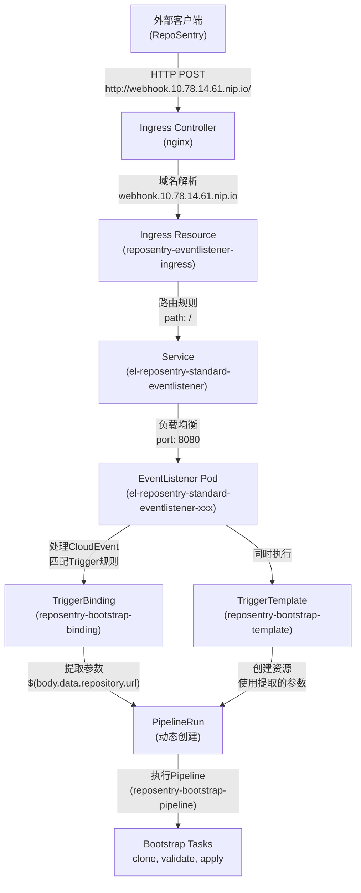

# RepoSentry Webhook 流量架构详解

## 📋 概述

本文档详细解释 RepoSentry 与 Tekton EventListener 之间的完整流量路径，澄清 Webhook、Ingress、EventListener、Trigger 等组件的关系和作用。

## 🏗️ 架构组件详解

### 1. 核心组件定义

#### 1.1 Webhook URL
```
定义: 外部客户端访问的统一入口地址
实例: http://webhook.10.78.14.61.nip.io/
本质: Kubernetes Ingress 对外暴露的域名
作用: 为 RepoSentry 提供发送 CloudEvent 的目标地址
```

#### 1.2 Ingress (入口网关)
```yaml
名称: reposentry-eventlistener-ingress
命名空间: reposentry-system
作用: 
  - 将外部 HTTP 请求路由到集群内部 Service
  - 提供域名到服务的映射关系
  - 处理 SSL/TLS 终止(如果配置)
```

#### 1.3 EventListener (事件监听器)
```yaml
名称: reposentry-standard-eventlistener  
命名空间: reposentry-system
作用:
  - 接收和解析 CloudEvent 格式的 HTTP 请求
  - 执行 CEL 过滤器匹配事件类型
  - 触发对应的 Trigger 处理链
```

#### 1.4 Trigger 处理链
```yaml
组件:
  - TriggerBinding: 从 CloudEvent 中提取参数
  - TriggerTemplate: 使用提取的参数创建 Kubernetes 资源
  - ClusterInterceptor: 执行事件过滤和预处理
```

### 2. 组件关系图



## 🌊 完整流量路径详解

### 阶段1: 外部请求发起
```bash
# RepoSentry 发送 CloudEvent
POST http://webhook.10.78.14.61.nip.io/
Headers:
  Ce-Type: dev.reposentry.repository.unknown
  Ce-Source: reposentry/github  
  Content-Type: application/json
Body:
  {
    "data": {
      "repository": {"url": "https://github.com/org/repo"},
      "commit": {"sha": "abc123"},
      "branch": {"name": "main"}
    }
  }
```

### 阶段2: DNS 解析与网络路由
```
webhook.10.78.14.61.nip.io 
    ↓ DNS 解析
10.78.14.61:80 
    ↓ 网络请求到达 Kubernetes 节点
nginx-ingress-controller Pod
```

### 阶段3: Ingress 规则匹配
```yaml
# nginx-ingress-controller 检查配置规则
rules:
- host: webhook.10.78.14.61.nip.io  # ✅ 主机名匹配
  http:
    paths:
    - path: /                        # ✅ 路径匹配 (所有路径)
      pathType: Prefix
      backend:
        service:
          name: el-reposentry-standard-eventlistener  # 转发目标
          port: 8080
```

### 阶段4: Service 负载均衡
```yaml
# Service 将请求转发到 Pod
Service: el-reposentry-standard-eventlistener
  type: ClusterIP
  clusterIP: 10.105.254.72
  ports: [8080, 9000]
  selector:
    eventlistener: reposentry-standard-eventlistener
    ↓ 负载均衡
Pod: el-reposentry-standard-eventlistener-xxx
  IP: 192.168.152.115:8080
```

### 阶段5: EventListener 事件处理
```yaml
# EventListener Pod 内部处理流程
1. 接收 HTTP 请求 (监听端口 8080)
2. 解析 CloudEvent headers 和 body
3. 执行 CEL 过滤器匹配:
   filter: header.match('ce-type', 'dev.reposentry.repository.*')
4. 如果匹配成功 → 触发 Trigger: reposentry-tekton-detected
```

### 阶段6: Trigger 处理链执行
```yaml
# 并行执行两个组件:

## TriggerBinding (参数提取)
name: reposentry-bootstrap-binding
参数提取:
  - repo-url: $(body.data.repository.url)
  - repo-branch: $(body.data.branch.name)  
  - commit-sha: $(body.data.commit.sha)
  - target-namespace: "reposentry-user-repo-$(hash)"
  - tekton-path: ".tekton"

## TriggerTemplate (资源创建)  
name: reposentry-bootstrap-template
动作:
  - 使用 TriggerBinding 提取的参数
  - 实例化 PipelineRun 模板
  - 在 reposentry-system 命名空间创建 PipelineRun
```

### 阶段7: Pipeline 执行
```yaml
# 创建的 PipelineRun 调用预部署的 Pipeline
apiVersion: tekton.dev/v1beta1
kind: PipelineRun
metadata:
  generateName: reposentry-bootstrap-run-
  namespace: reposentry-system
spec:
  pipelineRef:
    name: reposentry-bootstrap-pipeline  # 预部署的 Bootstrap Pipeline
  params:
    - name: repo-url
      value: "https://github.com/org/repo"
    - name: commit-sha  
      value: "abc123"
    - name: target-namespace
      value: "reposentry-user-repo-hash"
```

### 阶段8: Bootstrap Tasks 执行
```yaml
# Pipeline 按顺序执行 Tasks:
1. clone-user-repository:
   - git clone 用户仓库到指定 commit
   - 工作空间: source-workspace

2. validate-tekton-resources:
   - 验证 .tekton/ 目录下的 YAML 文件
   - 使用 kubectl --dry-run 验证语法
   - 复制文件到 tekton-workspace

3. apply-user-resources:
   - kubectl apply -f .tekton/*.yaml 
   - 在计算出的目标命名空间执行
   - 创建用户定义的 Pipeline/Task/PipelineRun
```

## 🔍 关键概念澄清

### Webhook vs Ingress 的关系
```
❌ 错误理解: Webhook 是一个独立的组件
✅ 正确理解: Webhook URL 就是 Ingress 的外部域名表示

Webhook URL = Ingress 配置的对外访问地址
```

### EventListener 的双重身份
```
身份1: Kubernetes 资源对象 (EventListener CRD)
身份2: 运行中的应用 Pod (实际处理逻辑)

EventListener 资源 → 自动创建 Pod → 自动创建 Service
```

### Trigger 的组合机制
```
Trigger 不是单一组件，而是处理链:
  EventListener → CEL过滤器 → TriggerBinding → TriggerTemplate → 资源创建
```

## 📊 网络层次详解

### Layer 1: 外部访问层
```
组件: Webhook URL
地址: http://webhook.10.78.14.61.nip.io/
作用: 为外部客户端提供统一访问入口
协议: HTTP/HTTPS
```

### Layer 2: Kubernetes 网络入口层  
```
组件: Ingress Controller + Ingress Resource
职责: 
  - 域名到 Service 的路由
  - SSL/TLS 终止
  - 负载均衡策略
```

### Layer 3: Kubernetes 服务层
```
组件: Service (ClusterIP)
职责:
  - Service Discovery
  - Pod 间负载均衡  
  - 端口映射 (8080)
```

### Layer 4: 应用处理层
```
组件: EventListener Pod
职责:
  - HTTP 请求处理
  - CloudEvent 解析
  - 业务逻辑执行
```

## 🚀 实际流量示例

### 完整请求-响应流程
```bash
# 1. RepoSentry 发送请求
curl -X POST http://webhook.10.78.14.61.nip.io/ \
  -H "Ce-Type: dev.reposentry.repository.unknown" \
  -H "Content-Type: application/json" \
  -d '{"data": {"repository": {"url": "https://github.com/org/repo"}}}'

# 2. 流量路径
外部请求 → DNS解析 → nginx-ingress → Ingress规则 → Service → EventListener Pod

# 3. EventListener 响应  
HTTP/1.1 202 Accepted
Content-Type: application/json
{
  "eventListener": "reposentry-standard-eventlistener",
  "namespace": "reposentry-system", 
  "eventID": "uuid-xxx"
}

# 4. 后台异步处理
EventListener → Trigger → PipelineRun创建 → Bootstrap Pipeline执行
```

## 🔧 故障排查指南

### 常见问题检查点
```bash
# 1. 检查 Ingress 状态
kubectl get ingress -n reposentry-system
kubectl describe ingress reposentry-eventlistener-ingress -n reposentry-system

# 2. 检查 Service 端点  
kubectl get endpoints el-reposentry-standard-eventlistener -n reposentry-system

# 3. 检查 EventListener Pod
kubectl get pods -n reposentry-system -l eventlistener=reposentry-standard-eventlistener
kubectl logs -n reposentry-system -l eventlistener=reposentry-standard-eventlistener

# 4. 验证网络连通性
curl -v http://webhook.10.78.14.61.nip.io/ -d '{"test": "ping"}'
```

### 配置验证清单
- [ ] Ingress 配置了正确的 host 和 backend service
- [ ] Ingress 指定了正确的 IngressClass (nginx)  
- [ ] Service 有可用的 endpoints
- [ ] EventListener Pod 处于 Running 状态
- [ ] TriggerBinding/TriggerTemplate 配置正确
- [ ] RBAC 权限完整 (triggers.tekton.dev 资源)

## 📚 相关资源

### 配置文件位置
```
Ingress: deployments/tekton/bootstrap/10-ingress.yaml
EventListener: deployments/tekton/bootstrap/08-eventlistener.yaml  
TriggerBinding: deployments/tekton/bootstrap/06-triggerbinding.yaml
TriggerTemplate: deployments/tekton/bootstrap/07-triggertemplate.yaml
RBAC: deployments/tekton/bootstrap/04-role.yaml
```

### 监控命令
```bash
# 实时查看 PipelineRun 创建
kubectl get pipelineruns -n reposentry-system -w

# 查看 EventListener 事件处理
kubectl logs -f -n reposentry-system -l eventlistener=reposentry-standard-eventlistener
```

---

*本文档基于 RepoSentry 项目的实际部署配置编写，涵盖完整的 Webhook → EventListener → Pipeline 执行流程。*
